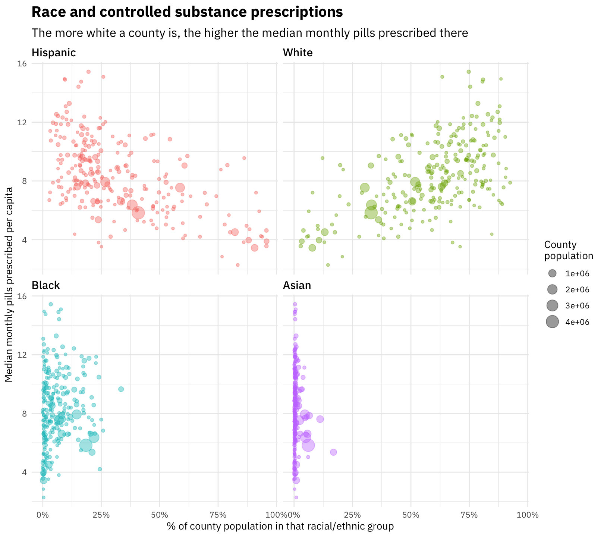
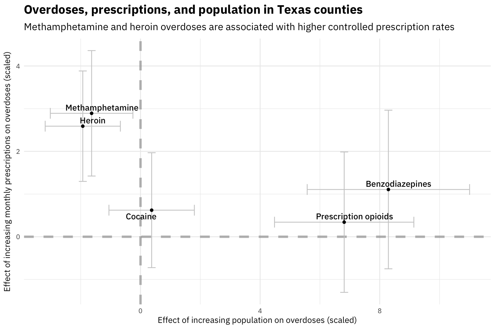

## Clean and tidy controlled substance utilization data

Let's open up the dataset and start munging and preparing it.


```r
library(tidyverse)
library(readxl)
library(lubridate)

path <- "CountyDrugPillQty_2017_07.xlsx"

opioids_raw <- path %>%
    excel_sheets() %>%
    set_names() %>%
    map_df(~ read_excel(path = path, sheet = .x), .id = "sheet") %>%
    mutate(Date = dmy(str_c("01-", sheet))) %>%
    select(-sheet) %>%
    rename(Name = `Generic Name`)
```


```r
library(googlesheets)

categories_sheet <- gs_title("Drug categories")
drug_categories <- categories_sheet %>%
    gs_read("Sheet1", verbose = FALSE) %>%
    rename(Name = `Generic Name`)

opioids_tidy <- opioids_raw %>%
    gather(County, Pills, ANDERSON:ZAVALA) %>%
    mutate(Pills = ifelse(Pills > 1e10, NA, Pills)) %>%
    replace_na(replace = list(Pills = 0)) %>%
    mutate(County = str_to_title(County)) %>%
    left_join(drug_categories, by = "Name") %>%
    select(County, Date, Name, Category, Schedule, Pills) %>%
    filter(Name != "Unspecified")

opioids_tidy
```

```
## # A tibble: 919,988 x 6
##    County   Date       Name                     Category   Schedule  Pills
##    <chr>    <date>     <chr>                    <chr>      <chr>     <dbl>
##  1 Anderson 2015-04-01 ACETAMINOPHEN WITH CODE… Opioid     III      37950.
##  2 Anderson 2015-04-01 ACETAMINOPHEN/CAFFEINE/… Opioid     III        380.
##  3 Anderson 2015-04-01 ALPRAZOLAM               Benzodiaz… IV       52914.
##  4 Anderson 2015-04-01 AMITRIPTYLINE HCL/CHLOR… Benzodiaz… IV         180.
##  5 Anderson 2015-04-01 AMPHETAMINE SULFATE      Amphetami… IV          60.
##  6 Anderson 2015-04-01 ARMODAFINIL              Stimulant  IV         824.
##  7 Anderson 2015-04-01 ASPIRIN/CAFFEINE/DIHYDR… Opioid     III          0.
##  8 Anderson 2015-04-01 BENZPHETAMINE HCL        Amphetami… III         30.
##  9 Anderson 2015-04-01 BROMPHENIRAMINE MALEATE… Opioid     V            0.
## 10 Anderson 2015-04-01 BROMPHENIRAMINE MALEATE… Opioid     III          0.
## # ... with 919,978 more rows
```

In this step, we removed the very small number of prescriptions that were missing drug and schedule information ("unspecified"). Now it's ready to go!

## Total number of pills prescribed over time

What does the overall pattern of pills prescribed looked like?


```r
opioids_tidy %>%
    group_by(Date) %>%
    summarise(Pills = sum(Pills)) %>%
    ggplot(aes(Date, Pills)) +
    geom_smooth(method = "lm") +
    geom_line(size = 1.5, alpha = 0.7) +
    expand_limits(y = 0) +
    labs(x = NULL, y = "Pills prescribed per month",
         title = "Controlled substance prescriptions in Texas",
         subtitle = "The median number of pills prescribed per month in Texas during this time period is 200 million")
```


We see evidence for modest growth over this time period. We need to compare to the population growth in the same time period to make a meaningful statement about the rate.


```r
library(broom)

fit_growth <- opioids_tidy %>%
    group_by(Date) %>%
    summarise(Pills = sum(Pills)) %>%
    lm(Pills ~ Date, data = .)

growth_rate <- (tidy(fit_growth) %>% 
                    filter(term == "Date") %>% 
                    pull(estimate)) / (opioids_tidy %>% 
                                           group_by(Date) %>% 
                                           summarise(Pills = sum(Pills)) %>% 
                                           pull(Pills) %>%
                                           median())
```

The number of pills prescribed per month is growing at about 0.00533% each month, or about 0.0639% each year. This is lower than the rate of Texas' population growth, estimate by the [US Census Bureau at about 1.4% annually](https://www.census.gov/newsroom/press-releases/2017/estimates-idaho.html). Given what we find out further below about the racial/ethnic implications of population level opioid use in Texas *and* what groups are driving population growth in Texas, this likely makes sense.

## Which drugs are growing or shrinking the fastest?

Let's examine how these prescriptions are changing with time. Let's use linear regression modeling to find the individual drugs that are being prescribed more often now compared to two years ago. Let's start with the schedules (II, III, IV, V).


```r
opioids_tidy %>%
    count(Schedule, wt = Pills, sort = TRUE) %>%
    mutate(Percent = percent(n / sum(n))) %>%
    select(-n) %>%
    kable(col.names = c("Schedule", "% of total pills over this time period"))
```


|Schedule |% of total pills over this time period |
|:--------|:--------------------------------------|
|IV       |42.6%                                  |
|II       |36.8%                                  |
|III      |16.8%                                  |
|V        |3.7%                                   |

```r
opioids_tidy %>%
    count(Schedule, Date, wt = Pills) %>%
    mutate(Schedule = factor(Schedule, levels = c("II", "III", "IV", "V",
                                                  "Unspecified"))) %>%
    ggplot(aes(Date, n, color = Schedule)) +
    geom_line(alpha = 0.8, size = 1.5) +
    expand_limits(y = 0) +
    labs(x = NULL, y = "Pills prescribed per month",
         title = "Controlled substance prescriptions by schedule",
         subtitle = "Schedule IV drugs account for the most doses, with Schedule II close behind")
```


This looks pretty flat, but let's fit some models.


```r
library(broom)

schedule_by_month <- opioids_tidy %>%
    group_by(Schedule, Date) %>%
    summarise(Pills = sum(Pills))

time_models <- schedule_by_month %>%    
    nest(-Schedule) %>%
    mutate(models = map(data, ~ lm(Pills ~ Date, .))) %>%
    unnest(map(models, tidy)) %>%
    filter(term == "Date") %>%
    arrange(desc(estimate))

time_models %>%
    kable()
```


|Schedule |term |   estimate| std.error| statistic|   p.value|
|:--------|:----|----------:|---------:|---------:|---------:|
|III      |Date |  7862.8225| 4571.0394|  1.720139| 0.0977647|
|IV       |Date |  6114.1057| 4828.6464|  1.266215| 0.2171080|
|V        |Date |   372.2876|  243.4479|  1.529229| 0.1387634|
|II       |Date | -3592.0228| 2595.3153| -1.384041| 0.1785783|

These models are all asking the question, "What is the rate of change of doses prescribed with time?" The p-values are all high (all > 0.05), indicating that we aren't seeing increases or decreases for any schedule, just like we see in the plot. The overall numbers of pills prescribed per month is mostly flat.

Now let's look at specific drug categories like opioid, stimulant, sedative, and so forth. What are the top 10?


```r
opioids_tidy %>%
    count(Category, wt = Pills, sort = TRUE) %>%
    mutate(Percent = percent(n / sum(n))) %>%
    top_n(10, n) %>%
    select(-n) %>%
    kable(col.names = c("Schedule", "% of total pills over this time period"))
```


|Schedule                    |% of total pills over this time period |
|:---------------------------|:--------------------------------------|
|Opioid                      |55.0%                                  |
|Benzodiazepine              |20.2%                                  |
|Amphetamine                 |10.6%                                  |
|GABA receptor agonist       |3.8%                                   |
|Sedative                    |3.8%                                   |
|Barbiturate                 |2.2%                                   |
|Anabolic Steroid            |1.6%                                   |
|Stimulant                   |1.0%                                   |
|Non-benzodiazepine hypnotic |0.5%                                   |
|Anticonvulsant              |0.5%                                   |

Opioids are by far dominant in these controlled substance prescriptions. Let's fit some models, including adjusting the p-value for multiple comparisons.


```r
category_by_month <- opioids_tidy %>%
    group_by(Category, Date) %>%
    summarise(Pills = sum(Pills))

time_models <- category_by_month %>%    
    nest(-Category) %>%
    mutate(models = map(data, ~ lm(Pills ~ Date, .))) %>%
    unnest(map(models, tidy)) %>%
    filter(term == "Date") %>%
    mutate(p.value = p.adjust(p.value)) %>%
    arrange(desc(estimate))

time_models %>%
    kable()
```


|Category                    |term |      estimate|    std.error|   statistic|   p.value|
|:---------------------------|:----|-------------:|------------:|-----------:|---------:|
|Benzodiazepine              |Date |  7890.1091912| 4011.7088729|   1.9667701| 0.4228248|
|Amphetamine                 |Date |  3310.9793829| 1040.8390051|   3.1810677| 0.0350305|
|NMDA Antagonist             |Date |  1768.3765149| 2177.6886310|   0.8120429| 1.0000000|
|Anabolic Steroid            |Date |  1640.3016899| 1430.7173738|   1.1464890| 1.0000000|
|Anticonvulsant              |Date |   279.2566388|   34.3064496|   8.1400623| 0.0000002|
|Hydroxybutyrate             |Date |   118.5813180|   41.1161393|   2.8840577| 0.0637075|
|Non-benzodiazepine hypnotic |Date |   114.5364188|   25.8721240|   4.4270203| 0.0019745|
|Stimulant                   |Date |    99.6909990|  161.7088376|   0.6164845| 1.0000000|
|Cannabinoid                 |Date |    26.4130968|    4.2404840|   6.2287929| 0.0000211|
|Phenobarbital               |Date |    -0.1081127|    0.1048886|  -1.0307379| 1.0000000|
|GABA receptor agonist       |Date |    -1.3689677|  245.5036854|  -0.0055762| 1.0000000|
|Steroid                     |Date |   -64.0199625|   16.6412557|  -3.8470632| 0.0080634|
|Serotonin Receptor Agonist  |Date |  -245.6500611|   14.4653548| -16.9819590| 0.0000000|
|Sedative                    |Date |  -723.3147267|  209.7954668|  -3.4477138| 0.0201241|
|Opioid                      |Date | -1588.6039402| 5653.2961884|  -0.2810049| 1.0000000|
|Barbiturate                 |Date | -1867.9520047|  189.2372196|  -9.8709546| 0.0000000|

Many of these p-values are high, indicating that they are not being prescribed more or less, but at mostly the same rate over this time period.

Which drugs are being prescribed *more* or *less*? These are the drugs that are show evidence of growing or shrinking over this time period, at the p < 0.05 level.


```r
opioids_tidy %>%
    inner_join(time_models %>%
                   filter(p.value < 0.05), by = "Category") %>%
    count(Date, Category, estimate, wt = Pills) %>%
    ggplot(aes(Date, n, color = estimate > 0)) +
    geom_line(size = 1.5, alpha = 0.8) +
    geom_smooth(method = "lm", se = FALSE, lty = 2) +
    scale_y_continuous(labels = scales::comma_format()) +
    expand_limits(y = 0) +
    facet_wrap(~Category, nrow = 3, scales = "free_y") +
    theme(legend.position="none") +
    theme(legend.title=element_blank()) +
    labs(x = NULL, y = "Pills prescribed per month",
         title = "Growing and shrinking controlled substances in Texas",
         subtitle = "Amphetamines are being prescribed more, and barbiturates are being prescribed less")
```


## Where is controlled substance use changing?

Let's use linear modeling to find counties where controlled substance use is changing.


```r
library(broom)

opioids_by_county <- opioids_tidy %>%
    group_by(County, Date) %>%
    summarise(Pills = sum(Pills))

county_models <- opioids_by_county %>%    
    nest(-County) %>%
    mutate(models = map(data, ~ lm(Pills ~ Date, .))) %>%
    unnest(map(models, tidy)) %>%
    filter(term == "Date") %>%
    arrange(desc(estimate))

county_models    
```

```
## # A tibble: 254 x 6
##    County    term  estimate std.error statistic p.value
##    <chr>     <chr>    <dbl>     <dbl>     <dbl>   <dbl>
##  1 Dallas    Date     6226.     3696.     1.68   0.105 
##  2 Tarrant   Date     4063.     1481.     2.74   0.0111
##  3 Denton    Date      877.      490.     1.79   0.0858
##  4 Val Verde Date      494.      194.     2.55   0.0173
##  5 Gregg     Date      463.      202.     2.29   0.0307
##  6 Bexar     Date      426.      982.     0.434  0.668 
##  7 Collin    Date      338.      360.     0.937  0.358 
##  8 Mclennan  Date      277.      242.     1.14   0.263 
##  9 Ellis     Date      261.      222.     1.17   0.253 
## 10 Hill      Date      259.      137.     1.89   0.0699
## # ... with 244 more rows
```

Which counties have seen the biggest increases?


```r
opioids_by_county %>%
    inner_join(county_models %>%
                   top_n(5, estimate)) %>%
    ggplot(aes(Date, Pills, color = County)) +
    geom_line(size = 1.5, alpha = 0.8) +
    geom_smooth(method = "lm", se = FALSE, lty = 2) +
    scale_y_continuous(labels = scales::comma_format()) +
    expand_limits(y = 0) +
    theme(legend.title=element_blank()) +
    labs(x = NULL, y = "Pills prescribed per month",
         title = "Controlled substance prescriptions in Texas",
         subtitle = "Dallas, Tarrant, and Denton are seeing the fastest growth")
```


What are counties that are experiencing decreases?


```r
opioids_by_county %>%
    inner_join(county_models %>%
                   top_n(-5, estimate)) %>%
    ggplot(aes(Date, Pills, color = County)) +
    geom_line(size = 1.5, alpha = 0.8) +
    geom_smooth(method = "lm", se = FALSE, lty = 2) +
    scale_y_continuous(labels = scales::comma_format()) +
    expand_limits(y = 0) +
    theme(legend.title=element_blank()) +
    labs(x = NULL, y = "Pills prescribed per month",
         title = "Controlled substance prescriptions in Texas",
         subtitle = "Harris and Travis counties are seeing decreases (or near decreases)")
```


## Connecting to Census data

Let's download some Census data to connect to this controlled substance prescription data.


```r
library(tidycensus)

population <- get_acs(geography = "county", 
                      variables = "B01003_001", 
                      state = "TX",
                      geometry = TRUE) 

population
```

```
## Simple feature collection with 254 features and 5 fields
## geometry type:  MULTIPOLYGON
## dimension:      XY
## bbox:           xmin: -106.6456 ymin: 25.83738 xmax: -93.50829 ymax: 36.5007
## epsg (SRID):    4269
## proj4string:    +proj=longlat +datum=NAD83 +no_defs
## First 10 features:
##    GEOID                  NAME   variable estimate moe
## 1  48175  Goliad County, Texas B01003_001     7463  NA
## 2  48185  Grimes County, Texas B01003_001    27140  NA
## 3  48215 Hidalgo County, Texas B01003_001   828334  NA
## 4  48225 Houston County, Texas B01003_001    22802  NA
## 5  48235   Irion County, Texas B01003_001     1631 135
## 6  48273 Kleberg County, Texas B01003_001    31877  NA
## 7  48277   Lamar County, Texas B01003_001    49626  NA
## 8  48317  Martin County, Texas B01003_001     5451  NA
## 9  48351  Newton County, Texas B01003_001    14138  NA
## 10 48361  Orange County, Texas B01003_001    83751  NA
##                          geometry
## 1  MULTIPOLYGON (((-97.77853 2...
## 2  MULTIPOLYGON (((-96.18831 3...
## 3  MULTIPOLYGON (((-98.5853 26...
## 4  MULTIPOLYGON (((-95.77535 3...
## 5  MULTIPOLYGON (((-101.2719 3...
## 6  MULTIPOLYGON (((-97.3178 27...
## 7  MULTIPOLYGON (((-95.85772 3...
## 8  MULTIPOLYGON (((-102.211 32...
## 9  MULTIPOLYGON (((-93.91113 3...
## 10 MULTIPOLYGON (((-94.11796 3...
```

```r
household_income <- get_acs(geography = "county", 
                            variables = "B19013_001", 
                            state = "TX",
                            geometry = TRUE) 

household_income
```

```
## Simple feature collection with 254 features and 5 fields
## geometry type:  MULTIPOLYGON
## dimension:      XY
## bbox:           xmin: -106.6456 ymin: 25.83738 xmax: -93.50829 ymax: 36.5007
## epsg (SRID):    4269
## proj4string:    +proj=longlat +datum=NAD83 +no_defs
## First 10 features:
##    GEOID                  NAME   variable estimate   moe
## 1  48175  Goliad County, Texas B19013_001    54375  6827
## 2  48185  Grimes County, Texas B19013_001    47839  3663
## 3  48215 Hidalgo County, Texas B19013_001    36094   765
## 4  48225 Houston County, Texas B19013_001    32434  2685
## 5  48235   Irion County, Texas B19013_001    64100  7621
## 6  48273 Kleberg County, Texas B19013_001    41469  3025
## 7  48277   Lamar County, Texas B19013_001    40283  1934
## 8  48317  Martin County, Texas B19013_001    63992 10522
## 9  48351  Newton County, Texas B19013_001    36829  2710
## 10 48361  Orange County, Texas B19013_001    51443  1876
##                          geometry
## 1  MULTIPOLYGON (((-97.77853 2...
## 2  MULTIPOLYGON (((-96.18831 3...
## 3  MULTIPOLYGON (((-98.5853 26...
## 4  MULTIPOLYGON (((-95.77535 3...
## 5  MULTIPOLYGON (((-101.2719 3...
## 6  MULTIPOLYGON (((-97.3178 27...
## 7  MULTIPOLYGON (((-95.85772 3...
## 8  MULTIPOLYGON (((-102.211 32...
## 9  MULTIPOLYGON (((-93.91113 3...
## 10 MULTIPOLYGON (((-94.11796 3...
```

To look at geographical patterns, we will take the median number of pills prescribed per month for each county during the time we have data for.


```r
opioids_joined <- opioids_by_county %>% 
    group_by(County) %>% 
    summarise(Pills = median(Pills)) %>% 
    mutate(County = str_to_lower(str_c(County, " County, Texas")),
           County = ifelse(County == "de witt county, texas",
                           "dewitt county, texas", County)) %>%
    inner_join(population %>% mutate(County = str_to_lower(NAME)), by = "County") %>%
    mutate(OpioidRate = Pills / estimate * 1e3)
```


#### Controlled substance prescription rate in the top 10 most populous Texas counties


```r
opioids_joined %>% 
    top_n(10, estimate) %>%
    arrange(desc(estimate)) %>%
    select(NAME, OpioidRate) %>%
    kable(col.names = c("County", "Median monthly pills per 1k population"))
```


|County                  | Median monthly pills per 1k population|
|:-----------------------|--------------------------------------:|
|Harris County, Texas    |                               5846.566|
|Dallas County, Texas    |                               6356.856|
|Tarrant County, Texas   |                               8015.746|
|Bexar County, Texas     |                               7538.256|
|Travis County, Texas    |                               6659.023|
|Collin County, Texas    |                               8007.805|
|El Paso County, Texas   |                               4584.352|
|Hidalgo County, Texas   |                               3496.856|
|Denton County, Texas    |                               7877.880|
|Fort Bend County, Texas |                               5324.904|

These rates vary a lot; the controlled substance prescription rate in Tarrant County is almost 40% higher than the rate in Harris County.

We can also map the state as a whole.


```r
library(sf)
library(viridis)

opioids_map <- opioids_joined %>%
    mutate(OpioidRate = ifelse(OpioidRate > 1.6e4, 1.6e4, OpioidRate))

opioids_map %>%
    st_as_sf() %>%
    ggplot(aes(fill = OpioidRate, color = OpioidRate)) + 
    geom_sf() + 
    coord_sf() + 
    scale_fill_viridis(labels = comma_format()) + 
    scale_color_viridis(guide = FALSE) +
    labs(fill = "Monthly pills\nper 1k population")
```


There are low rates in the Rio Grande Valley and high rates in north and east Texas.

Is there a direct relationship with income? Do we see connections to the financial status of a county?


```r
opioids_joined %>% 
    filter(OpioidRate < 2e4) %>%
    group_by(GEOID, Population = estimate) %>% 
    summarise(OpioidRate = median(OpioidRate)) %>%
    inner_join(household_income %>%
                   as.data.frame() %>%
                   select(-geometry, -variable) %>%
                   rename(Income = estimate)) %>%
    ggplot(aes(Income, OpioidRate, size = Population)) +
    geom_point(alpha = 0.7) +
    geom_smooth(method = "lm", show.legend = FALSE) +
    scale_x_continuous(labels = scales::dollar_format()) +
    scale_y_continuous(labels = scales::comma_format()) +
    labs(x = "Median household income", 
         y = "Median monthly prescribed pills per 1k population",
         title = "Income and controlled substance prescriptions",
         subtitle = "There is no clear relationship between income and prescriptions")
```




Not really. There is no strong relationship here apparent visually, and this is confirmed by modeling (no significant linear relationship). We *can* notice that all the extremely populous counties are low in the plot, with lower controlled substance rates compared to counties of similar income.

What about race?


```r
race_vars <- c("P0050003", "P0050004", "P0050006", "P0040003")

texas_race <- get_decennial(geography = "county", 
                            variables = race_vars, 
                            state = "TX",
                            summary_var = "P0010001") 

texas_race
```

```
## # A tibble: 1,016 x 5
##    GEOID NAME             variable  value summary_value
##    <chr> <chr>            <chr>     <dbl>         <dbl>
##  1 48001 Anderson County  P0050003 35792.        58458.
##  2 48003 Andrews County   P0050003  7083.        14786.
##  3 48005 Angelina County  P0050003 54889.        86771.
##  4 48007 Aransas County   P0050003 16350.        23158.
##  5 48009 Archer County    P0050003  8182.         9054.
##  6 48011 Armstrong County P0050003  1725.         1901.
##  7 48013 Atascosa County  P0050003 16295.        44911.
##  8 48015 Austin County    P0050003 18657.        28417.
##  9 48017 Bailey County    P0050003  2745.         7165.
## 10 48019 Bandera County   P0050003 16576.        20485.
## # ... with 1,006 more rows
```


```r
race_joined <- texas_race %>%
    mutate(PercentPopulation = value / summary_value,
           variable = fct_recode(variable,
                                 White = "P0050003",
                                 Black = "P0050004",
                                 Asian = "P0050006",
                                 Hispanic = "P0040003")) %>%
    inner_join(opioids_joined %>%
                   filter(OpioidRate < 2e4) %>%
                   group_by(GEOID) %>% 
                   summarise(OpioidRate = median(OpioidRate)))

race_joined %>%
    rename(Population = summary_value) %>%
    ggplot(aes(PercentPopulation, OpioidRate, 
               size = Population, color = variable)) +
    geom_point(alpha = 0.4) +
    #geom_smooth(method = "lm", lty = 2, se = FALSE) +
    facet_wrap(~variable) +
    #theme(legend.position="none") +
    scale_x_continuous(labels = scales::percent_format()) +
    scale_y_continuous(labels = scales::comma_format()) +
    scale_color_discrete(guide = FALSE) +
    labs(x = "% of county population in that racial/ethnic group",
         y = "Median monthly pills prescribed per 1k population",
         title = "Race and controlled substance prescriptions",
         subtitle = "The more white a county is, the higher the median monthly pills prescribed there",
         size = "County\npopulation")
```


The more white a county is, the higher the rate of controlled substance prescription there. The more Hispanic a county is, the lower the rate of controlled substance prescription there. Remember that we did not see an effect with income, though.

We can build a model to predict the monthly prescriptions with both race and income and see what has an effect when you control for both. Using the simple exploratory model below, it looks like it may be an interaction of race and income, i.e., poorer counties with large white populations have high rates of controlled substance use.


```r
model_opioids <- race_joined %>%
    select(GEOID, OpioidRate, TotalPop = summary_value,
           variable, PercentPopulation) %>%
    spread(variable, PercentPopulation) %>%
    left_join(household_income %>% 
                  select(GEOID, Income = estimate)) %>%
    select(-geometry, -GEOID) %>%
    lm(OpioidRate ~ Income * White, data = .)

summary(model_opioids)
```

```
## 
## Call:
## lm(formula = OpioidRate ~ Income * White, data = .)
## 
## Residuals:
##     Min      1Q  Median      3Q     Max 
## -5973.7 -1021.6    24.8  1163.2  5165.5 
## 
## Coefficients:
##                Estimate Std. Error t value Pr(>|t|)    
## (Intercept)   4.236e+03  1.332e+03   3.181  0.00166 ** 
## Income        2.863e-04  3.087e-02   0.009  0.99261    
## White         1.300e+04  2.187e+03   5.946 9.24e-09 ***
## Income:White -9.692e-02  4.918e-02  -1.971  0.04985 *  
## ---
## Signif. codes:  0 '***' 0.001 '**' 0.01 '*' 0.05 '.' 0.1 ' ' 1
## 
## Residual standard error: 1847 on 249 degrees of freedom
## Multiple R-squared:  0.4959,	Adjusted R-squared:  0.4899 
## F-statistic: 81.66 on 3 and 249 DF,  p-value: < 2.2e-16
```

Including total population in this model does not make it a better model; total population is not a significant predictor and it does not improve the model interms of $R^2$ or residuals. Using the proportion of population that is Hispanic gives a model that is about as good; these are basically interchangeable but opposite in effect.

We can explore the interaction between income and ethnicity visually. 


```r
race_joined %>%
    filter(variable == "White") %>%
    left_join(household_income %>% 
                  as.data.frame() %>% 
                  select(GEOID, Income = estimate)) %>%
    filter(!is.na(Income)) %>%
    mutate(Income = ifelse(Income <= median(Income, na.rm = TRUE), 
                           "Low income", "High income"),
           PercentPopulation = cut_width(PercentPopulation, 0.1)) %>%
    group_by(PercentPopulation, Income) %>%
    summarise(OpioidRate = median(OpioidRate)) %>%
    complete(PercentPopulation, Income) %>%
    ggplot(aes(PercentPopulation, OpioidRate, color = Income, group = Income)) +
    geom_line(size = 1.5, alpha = 0.8) +
    scale_y_continuous(labels = scales::comma_format(),
                       limits = c(0, NA)) +
    scale_x_discrete(labels = paste0(seq(0, 0.9, by = 0.1) * 100, "%")) +
    labs(x = "% of county population that is white",
         y = "Median monthly pills prescribed per 1k population",
         color = NULL,
         title = "White population, income, and controlled substance usage",
         subtitle = "The more white a county is, the more low income is associated with more controlled substance usage")
```


This plot illustrates the interaction between white population percentage and income. The difference in controlled substance usage between lower and higher income counties (above and below the median in Texas) changes along the spectrum of counties' population that is white.

The first effect to notice here is that the more white a county is, the higher the rate of controlled substance prescriptions, for both groups of counties. The second thing, though, is to compare the slopes of the two lines. In higher income counties (above the median in Texas), the slope is shallower, but in lower income counties (below the median in Texas), the slope is steeper, i.e., the increase in prescription rate with white percentage is more dramatic. At the population level, controlled substance prescriptions are associated with how white a population is, and how low the income of that white population is.


## Connecting to overdoses

We can also use the data gathered on overdoses due to prescriptions controlled substances and other drugs to see what connections there are.


```r
path <- "UTSouthwestern170731Opioids.xls"

overdoses_tidy <- path %>%
    excel_sheets() %>%
    set_names() %>%
    map_df(~ read_excel(path = path, sheet = .x, skip = 9), .id = "sheet") %>%
    gather(Date, Overdoses, `201301`:`201706`) %>%
    mutate(Date = ymd(str_c(Date, "01")),
           Overdoses = case_when(Overdoses == "*" ~ "Less than 5",
                                 as.numeric(Overdoses) < 10 ~ "5 to 10",
                                 as.numeric(Overdoses) > 10 ~ "More than 10",
                                 is.na(Overdoses) ~ "Zero"),
           Overdoses = factor(Overdoses, levels = c("Zero", "Less than 5",
                                                    "5 to 10", "More than 10")))
```


```r
overdoses_tidy %>%
    inner_join(opioids_by_county %>%
                   ungroup %>%
                   mutate(County = toupper(County)), 
               by = c("County", "Date")) %>%
    filter(!is.na(Overdoses)) %>%
    ggplot(aes(Overdoses, Pills, fill = sheet)) +
    geom_boxplot(outlier.alpha = 0.5, alpha = 0.8,
                 show.legend = FALSE, position = "dodge") +
    facet_wrap(~sheet) +
    scale_y_log10() +
    labs(y = "Median monthly pills prescribed",
         title = "Overdoses and prescriptions in Texas counties",
         subtitle = "Counties with higher rates of prescriptions have higher rates of overdoses from all classes of drugs")
```


Having higher rates of overdoses (more than 10 in a month) is rare but we do see that counties with higher numbers of overdoses in a month are the counties with higher numbers of controlled substance prescriptions. The counties with zero overdoses have a broad range of controlled substance prescription rates.

We see that having higher prescriptions rates in a month is associated in raw number with higher overdoses in a month for *all* types of drugs. We want to know how controlled substance prescriptions affect this, to see if the increase is larger for, say, heroin and opioids than for unrelated drugs like cocaine, and how this changes when controlling for population (large vs. small counties).


```r
overdoses_joined <- overdoses_tidy %>% 
    group_by(sheet, County, Overdoses) %>% 
    summarize(Total = n()) %>% 
    filter(!is.na(Overdoses)) %>% 
    group_by(sheet, County) %>% 
    filter(Total == last(Total)) %>%
    ungroup %>%
    left_join(opioids_joined %>%
                  transmute(County = toupper(str_replace_all(County, " county, texas", "")),
                            Population = estimate,
                            Pills) %>%
                  mutate(County = ifelse(County == "DEWITT",
                                         "DE WITT", County)))

model_results <- overdoses_joined %>%
    mutate(Population = scale(Population),
           Pills = scale(Pills)) %>%
    nest(-sheet) %>%
    mutate(models = map(data, ~ ordinal::clm(Overdoses ~ Population + Pills, data = .))) %>%
    unnest(map(models, tidy)) %>%
    filter(term %in% c("Population", "Pills")) %>%
    arrange(sheet) %>%
    select(-statistic, -p.value) 

library(ggrepel)

model_results %>%
    select(-std.error) %>%
    spread(term, estimate) %>%
    left_join(model_results %>%
                  select(-estimate) %>%
                  spread(term, std.error),
              by = "sheet",
              suffix = c("", "Error")) %>%
    ggplot(aes(Population, Pills, label = sheet)) +
    geom_hline(size = 1.5, lty = 2, color = "gray50",
               yintercept = 0, alpha = 0.5) +
    geom_vline(size = 1.5, lty = 2, color = "gray50",
               xintercept = 0, alpha = 0.5) +
    geom_errorbar(aes(ymin = Pills - PillsError,
                      ymax = Pills + PillsError),
                  color = "gray80") +
    geom_errorbarh(aes(xmin = Population - PopulationError,
                       xmax = Population + PopulationError),
                   color = "gray80") +
    geom_text_repel(family = "IBMPlexSans-Medium") +
    geom_point() +
    labs(x = "Effect of increasing population on overdoses (scaled)",
         y = "Effect of increasing monthly prescriptions on overdoses (scaled)",
         title = "Overdoses, prescriptions, and population in Texas counties",
         subtitle = "Methamphetamine and heroin overdoses are associated with higher controlled prescription rates")
```



Overdoses are rare overall so we are limited in how precisely we can measure how they depend on other quantities at a population level. When controlling for population, the effect size on overdoses from increasing monthly controlled substance prescriptions is significant for methamphetamines and heroin but not for any other category of overdoses, including opioids themselves. (Remember that the controlled substance prescriptions are dominated by opioids.) Prescription opioid and benzodiazepine overdoses increase with population, but we do not see evidence in this dataset that they are related to increasing prescriptions.

Let's look at how the overdoses are distributed.


```r
overdoses_map <- opioids_joined %>%
    select(County) %>%
    left_join(overdoses_tidy %>%
                  mutate(OverdosesNumber = case_when(Overdoses == "Zero" ~ 0,
                                                     Overdoses == "Less than 5" ~ 3,
                                                     Overdoses == "5 to 10" ~ 7,
                                                     Overdoses == "More than 10" ~ 10)) %>%
                  group_by(sheet, County) %>%
                  summarise(Overdoses = mean(OverdosesNumber, na.rm = TRUE)) %>%
                  ungroup %>%
                  mutate(County = if_else(County == "DEWITT", "DE WITT", County),
                         County = str_to_lower(County),
                         County = str_c(County, " county, texas"))) %>%
    complete(sheet, County, fill = list(Overdoses = 0)) %>%
    filter(!is.na(sheet)) %>%
    inner_join(opioids_joined %>% 
                   select(County, GEOID, NAME, geometry))

overdoses_map %>%
    st_as_sf() %>%
    ggplot(aes(fill = Overdoses, color = Overdoses)) + 
    geom_sf() + 
    coord_sf() + 
    facet_wrap(~sheet, nrow = 1) +
    scale_fill_viridis(labels = comma_format()) + 
    scale_color_viridis(guide = FALSE) +
    labs(fill = "Overdoses",
         title = "Monthly mean overdoses in Texas counties",
         subtitle = "Only heroin and methamphetamine exhibit evidence of increasing with controlled substance prescriptions, after controlling for population")
```


These maps show that, naturally, there are more overdoses where there are more people. When fitting a model that controls for both population *and* number of pills prescribed, we start to see the differences described above.
