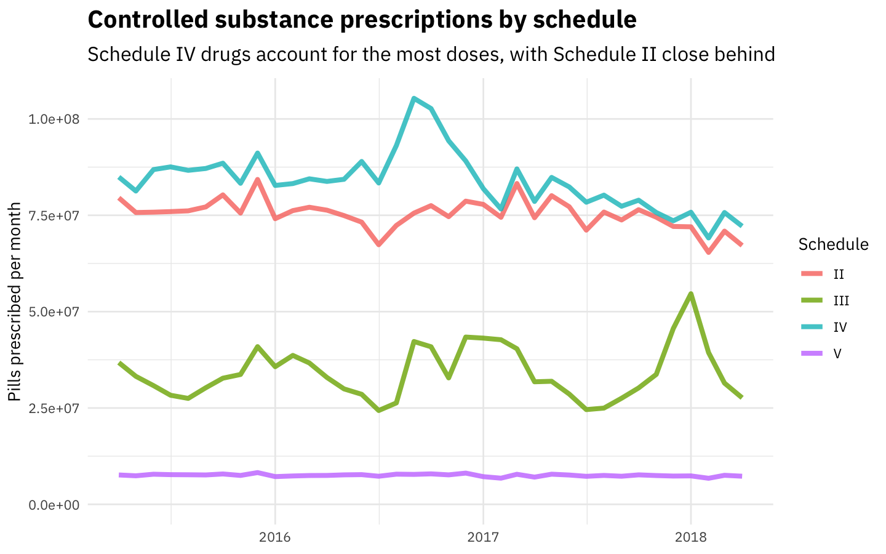
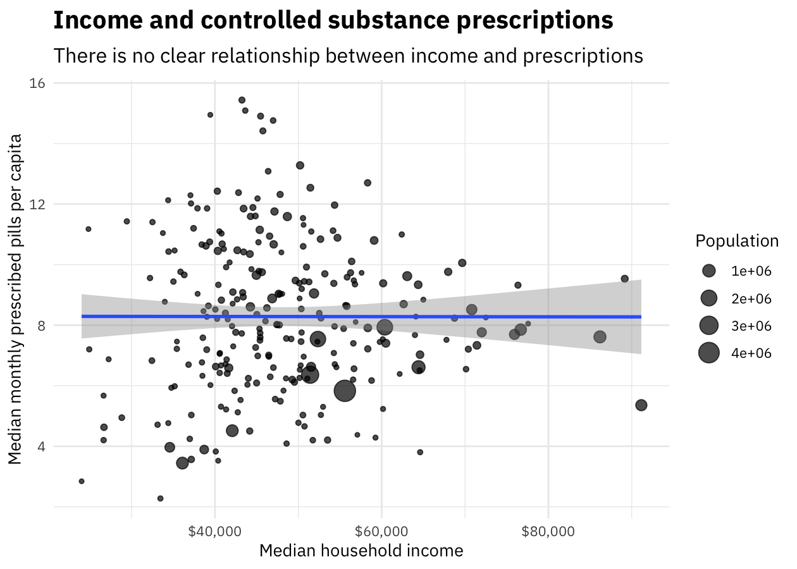
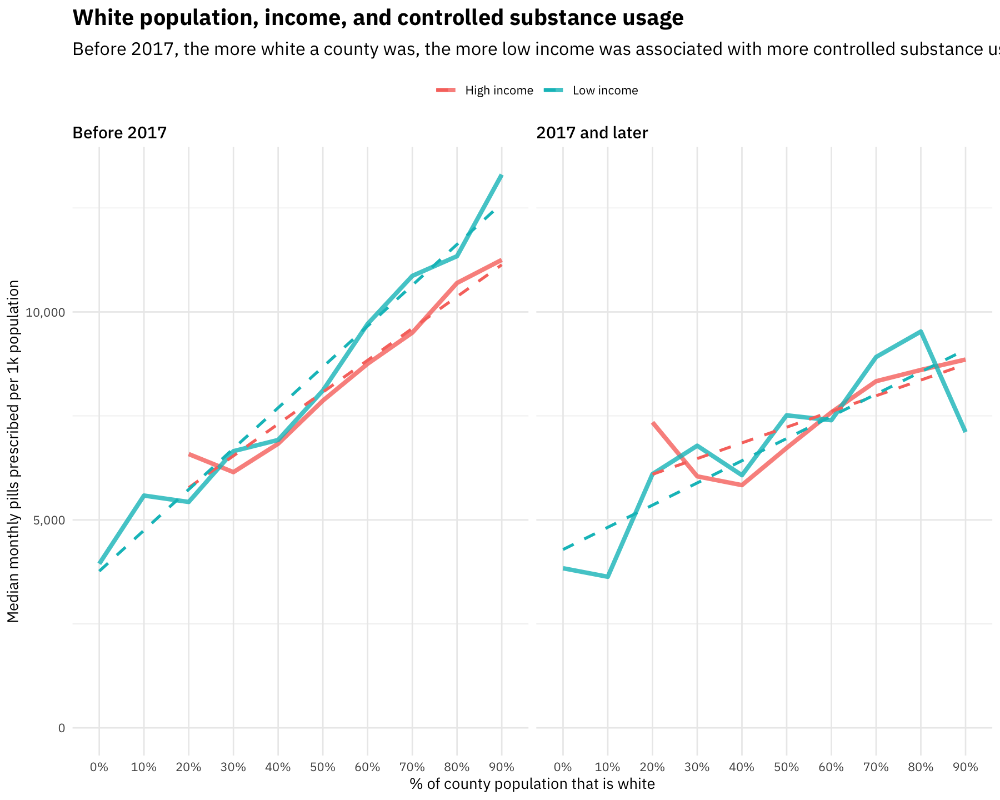

## Clean and tidy controlled substance utilization data

Let's open up the dataset and start munging and preparing it.


```r
library(tidyverse)
library(readxl)
library(lubridate)
library(googlesheets)

path <- "CountyDrugPillQty_2017_07.xlsx"

opioids_raw <- path %>%
  excel_sheets() %>%
  set_names() %>%
  map_df(~ read_excel(path = path, sheet = .x), .id = "sheet") %>%
  mutate(Date = dmy(str_c("01-", sheet))) %>%
  select(-sheet) %>%
  rename(Name = `Generic Name`)

new_opioids_sheet <- gs_title("TX CS Qty By Drug Name-County")

new_opioids_raw <- new_opioids_sheet %>%
  gs_read("TX CS RX By Generic Name-County",
          col_types = "cnnnnnnnnnnnnnnnnnnnnnnnnnnnnnnnnnnnnnnnnnnnnnnnnnnnnnnnnnnnnnnnnnnnnnnnnnnnnnnnnnnnnnnnnnnnnnnnnnnnnnnnnnnnnnnnnnnnnnnnnnnnnnnnnnnnnnnnnnnnnnnnnnnnnnnnnnnnnnnnnnnnnnnnnnnnnnnnnnnnnnnnnnnnnnnnnnnnnnnnnnnnnnnnnnnnnnnnnnnnnnnnnnnn",
          skip = 4,
          verbose = FALSE) %>%
  rename(Name = `Date/Month Filter`)  %>% 
  mutate(Date = case_when(str_detect(Name, 
                                     "^[a-zA-Z]{3}-[0-9]{2}$") ~ Name,
                          TRUE ~ NA_character_)) %>%
  fill(Date, .direction = "down") %>%
  select(-`Grand Total`) %>%
  filter(Name != Date) %>%
  mutate(Date = dmy(str_c("01-", Date))) %>%
  select(Name, Date, everything())
```

We have overlapping measurements for the same drugs and counties from February to June of 2017. How do these measurements compare to each other?


```r
## comparing the counts for the overlapping time period

compare <- opioids_raw %>%
  filter(Date > "2017-01-01") %>%
  gather(County, PillsOld, ANDERSON:ZAVALA) %>%
  inner_join(new_opioids_raw %>% 
               gather(County, PillsNew, ANDERSON:ZAVALA)) %>%
  mutate(PercentChange = abs(PillsOld - PillsNew) / PillsOld)

compare %>%    
  ggplot(aes(PillsOld, PillsNew, color = County)) +
  geom_abline(color = "gray50", lty = 2, alpha = 0.8, size = 1.6) +
  geom_point(alpha = 0.4, size = 1.7, show.legend = FALSE) +
  labs(x = "Count from old data",
       y = "Count from new data",
       title = "How close are the prescription quantities in each dataset?",
       subtitle = "Comparing the same drug in the same county")
```


Most measurements are close, and the median change is about 20%. The new data is modestly higher in prescription quantity. When we have, it we'll use the new values.


```r
categories_sheet <- gs_title("Drug categories")
drug_categories <- categories_sheet %>%
  gs_read("Sheet1", verbose = FALSE) %>%
  rename(Name = `Generic Name`) %>%
  bind_rows(categories_sheet %>%
              gs_read("Sheet2", verbose = FALSE) %>%
              rename(Name = `Generic Name`)) %>%
  filter(Schedule %in% c("II", "III", "IV", "V"))

opioids_tidy <- opioids_raw %>%
  gather(County, PillsOld, ANDERSON:ZAVALA) %>%
  full_join(new_opioids_raw %>% 
              gather(County, PillsNew, ANDERSON:ZAVALA),
            by = c("Name", "Date", "County")) %>%
  mutate(Pills = coalesce(PillsNew, PillsOld),
         Pills = ifelse(Pills > 1e10, NA, Pills)) %>%
  replace_na(replace = list(Pills = 0)) %>%
  mutate(County = str_to_title(County)) %>% 
  select(-PillsNew, -PillsOld) %>%
  left_join(drug_categories, by = "Name") %>%
  select(County, Date, Name, Category, Schedule, Pills) %>%
  filter(Name != "Unspecified",
         !is.na(Schedule)) %>%
  filter(Date < "2018-05-01")

opioids_tidy
```

```
## # A tibble: 1,234,622 x 6
##    County   Date       Name                           Category   Schedule Pills
##    <chr>    <date>     <chr>                          <chr>      <chr>    <dbl>
##  1 Anderson 2015-04-01 ACETAMINOPHEN WITH CODEINE PH… Opioid     III      37950
##  2 Anderson 2015-04-01 ACETAMINOPHEN/CAFFEINE/DIHYDR… Opioid     III        380
##  3 Anderson 2015-04-01 ALPRAZOLAM                     Benzodiaz… IV       52914
##  4 Anderson 2015-04-01 AMITRIPTYLINE HCL/CHLORDIAZEP… Benzodiaz… IV         180
##  5 Anderson 2015-04-01 AMPHETAMINE SULFATE            Amphetami… IV          60
##  6 Anderson 2015-04-01 ARMODAFINIL                    Stimulant  IV         824
##  7 Anderson 2015-04-01 ASPIRIN/CAFFEINE/DIHYDROCODEI… Opioid     III          0
##  8 Anderson 2015-04-01 BENZPHETAMINE HCL              Amphetami… III         30
##  9 Anderson 2015-04-01 BROMPHENIRAMINE MALEATE/PHENY… Opioid     V            0
## 10 Anderson 2015-04-01 BROMPHENIRAMINE MALEATE/PSEUD… Opioid     III          0
## # ... with 1,234,612 more rows
```

In this step, we removed the very small number of prescriptions that were missing drug and schedule information ("unspecified"). Now it's ready to go!

## Total number of pills prescribed over time

What does the overall pattern of pills prescribed looked like?


```r
opioids_tidy %>%
  group_by(Date) %>%
  summarise(Pills = sum(Pills) / 1e6) %>%
  ggplot(aes(Date, Pills)) +
  geom_smooth(method = "lm") +
  geom_line(size = 1.5, alpha = 0.7) +
  expand_limits(y = 0) +
  labs(x = NULL, y = "Pills prescribed per month (million)",
       title = "Controlled substance prescriptions in Texas",
       subtitle = "The median number of pills prescribed per month in Texas during this time period is 200 million")
```


We see evidence for modest decrease over this time period. We need to compare to the population growth in the same time period to make a meaningful statement about the rate.


```r
library(broom)

fit_growth <- opioids_tidy %>%
  group_by(Date) %>%
  summarise(Pills = sum(Pills)) %>%
  lm(Pills ~ Date, data = .)

growth_rate <- (tidy(fit_growth) %>% 
                  filter(term == "Date") %>% 
                  pull(estimate)) / (opioids_tidy %>% 
                                       group_by(Date) %>% 
                                       summarise(Pills = sum(Pills)) %>% 
                                       pull(Pills) %>%
                                       median())
```

The number of pills prescribed per month is changing at about -0.00751% each month, or about -0.0901% each year. This is lower than the rate of Texas' population growth, estimated by the [US Census Bureau at about 1.4% annually](https://www.census.gov/newsroom/press-releases/2017/estimates-idaho.html). Given what we find out further below about the racial/ethnic implications of population level opioid use in Texas *and* what groups are driving population growth in Texas, this likely makes sense.

## Which drugs are growing or shrinking the fastest?

Let's examine how these prescriptions are changing with time. Let's use linear regression modeling to find the individual drugs that are being prescribed more often now compared to two years ago. Let's start with the schedules (II, III, IV, V).


```r
opioids_tidy %>%
  count(Schedule, wt = Pills, sort = TRUE) %>%
  mutate(Percent = percent(n / sum(n))) %>%
  select(-n) %>%
  kable(col.names = c("Schedule", "% of total pills over this time period"))
```


|Schedule |% of total pills over this time period |
|:--------|:--------------------------------------|
|IV       |41.7%                                  |
|II       |37.5%                                  |
|III      |17.0%                                  |
|V        |3.8%                                   |

```r
opioids_tidy %>%
  count(Schedule, Date, wt = Pills) %>%
  mutate(Schedule = factor(Schedule, levels = c("II", "III", "IV", "V",
                                                "Unspecified"))) %>%
  ggplot(aes(Date, n, color = Schedule)) +
  geom_line(alpha = 0.8, size = 1.5) +
  expand_limits(y = 0) +
  labs(x = NULL, y = "Pills prescribed per month",
       title = "Controlled substance prescriptions by schedule",
       subtitle = "Schedule IV drugs account for the most doses, with Schedule II close behind")
```



This looks pretty flat, but let's fit some models.


```r
library(broom)

schedule_by_month <- opioids_tidy %>%
  group_by(Schedule, Date) %>%
  summarise(Pills = sum(Pills))

time_models <- schedule_by_month %>%    
  nest(-Schedule) %>%
  mutate(models = map(data, ~ lm(Pills ~ Date, .))) %>%
  unnest(map(models, tidy)) %>%
  filter(term == "Date") %>%
  arrange(desc(estimate))

time_models %>%
  kable()
```


|Schedule |term |   estimate| std.error|  statistic|   p.value|
|:--------|:----|----------:|---------:|----------:|---------:|
|III      |Date |   2730.857| 3486.1241|  0.7833504| 0.4386903|
|V        |Date |   -350.583|  149.9851| -2.3374522| 0.0252616|
|II       |Date |  -5392.202| 1790.4440| -3.0116564| 0.0048008|
|IV       |Date | -11985.809| 3302.4011| -3.6294224| 0.0008983|

These models are all asking the question, "What is the rate of change of doses prescribed with time?" The p-values are almost all high (all > 0.05), indicating that we aren't seeing increases or decreases for any schedule, just like we see in the plot. The overall numbers of pills prescribed per month is mostly flat.

Now let's look at specific drug categories like opioid, stimulant, sedative, and so forth. What are the top 10?


```r
opioids_tidy %>%
  count(Category, wt = Pills, sort = TRUE) %>%
  mutate(Percent = percent(n / sum(n))) %>%
  top_n(10, n) %>%
  select(-n) %>%
  kable(col.names = c("Schedule", "% of total pills over this time period"))
```


|Schedule                    |% of total pills over this time period |
|:---------------------------|:--------------------------------------|
|Opioid                      |55.9%                                  |
|Benzodiazepine              |19.3%                                  |
|Amphetamine                 |11.1%                                  |
|Sedative                    |3.8%                                   |
|GABA receptor agonist       |3.8%                                   |
|Barbiturate                 |2.1%                                   |
|Anabolic Steroid            |1.3%                                   |
|Stimulant                   |1.0%                                   |
|Anticonvulsant              |0.6%                                   |
|Non-benzodiazepine hypnotic |0.5%                                   |

Opioids are by far dominant in these controlled substance prescriptions. Let's fit some models, including adjusting the p-value for multiple comparisons.


```r
category_by_month <- opioids_tidy %>%
  group_by(Category, Date) %>%
  summarise(Pills = sum(Pills))

time_models <- category_by_month %>%    
  nest(-Category) %>%
  mutate(models = map(data, ~ lm(Pills ~ Date, .))) %>%
  unnest(map(models, tidy)) %>%
  filter(term == "Date") %>%
  mutate(p.value = p.adjust(p.value)) %>%
  arrange(desc(estimate))

time_models %>%
  kable()
```


|Category                    |term |      estimate|    std.error|   statistic|   p.value|
|:---------------------------|:----|-------------:|------------:|-----------:|---------:|
|Amphetamine                 |Date |  2348.2617099|  669.2684877|   3.5086991| 0.0113232|
|Anticonvulsant              |Date |   628.7830872|   44.7212473|  14.0600525| 0.0000000|
|Cannabinoid                 |Date |     3.4354408|    5.1333999|   0.6692330| 1.0000000|
|Opioid antagonist           |Date |    -0.0450837|    0.0833197|  -0.5410924| 1.0000000|
|Phenobarbital               |Date |    -0.0508762|    0.0345908|  -1.4708013| 1.0000000|
|Non-benzodiazepine hypnotic |Date |    -9.5126252|   19.0694192|  -0.4988419| 1.0000000|
|Stimulant                   |Date |   -37.9134642|   94.5509162|  -0.4009846| 1.0000000|
|Steroid                     |Date |  -104.5924121|    9.6345567| -10.8559652| 0.0000000|
|NMDA Antagonist             |Date |  -141.1792884| 1176.6079118|  -0.1199884| 1.0000000|
|Serotonin Receptor Agonist  |Date |  -275.4392966|    7.9341568| -34.7156356| 0.0000000|
|Hydroxybutyrate             |Date |  -457.6104921|   74.6518946|  -6.1299247| 0.0000057|
|GABA receptor agonist       |Date | -1059.9940658|  160.3633234|  -6.6099532| 0.0000015|
|Anabolic Steroid            |Date | -1234.9237030|  225.8359175|  -5.4682343| 0.0000388|
|Sedative                    |Date | -1315.2821309|  126.3179537| -10.4124718| 0.0000000|
|Barbiturate                 |Date | -1706.0414557|  104.4197493| -16.3383025| 0.0000000|
|Opioid                      |Date | -5550.5513927| 4076.7680269|  -1.3615078| 1.0000000|
|Benzodiazepine              |Date | -6085.1176107| 2648.4658639|  -2.2976009| 0.2214334|

Many of these p-values are high, indicating that they are not being prescribed more or less, but at mostly the same rate over this time period.

Which drugs are being prescribed *more* or *less*? These are the drugs that are show evidence of growing or shrinking over this time period, at the p < 0.05 level.


```r
opioids_tidy %>%
  inner_join(time_models %>%
               filter(p.value < 0.05), by = "Category") %>%
  count(Date, Category, estimate, wt = Pills) %>%
  ggplot(aes(Date, n, color = estimate > 0)) +
  geom_line(size = 1.5, alpha = 0.8) +
  geom_smooth(method = "lm", se = FALSE, lty = 2) +
  scale_y_continuous(labels = scales::comma_format()) +
  expand_limits(y = 0) +
  facet_wrap(~Category, nrow = 3, scales = "free_y") +
  theme(legend.position="none") +
  theme(legend.title=element_blank()) +
  labs(x = NULL, y = "Pills prescribed per month",
       title = "Growing and shrinking controlled substances in Texas",
       subtitle = "Amphetamines are being prescribed more, and barbiturates are being prescribed less")
```


## Where is controlled substance use changing?

Let's use linear modeling to find counties where controlled substance use is changing.


```r
library(broom)

opioids_by_county <- opioids_tidy %>%
  group_by(County, Date) %>%
  summarise(Pills = sum(Pills))

county_models <- opioids_by_county %>%    
  nest(-County) %>%
  mutate(models = map(data, ~ lm(Pills ~ Date, .))) %>%
  unnest(map(models, tidy)) %>%
  filter(term == "Date") %>%
  arrange(desc(estimate))

county_models    
```

```
## # A tibble: 256 x 6
##    County  term  estimate std.error statistic       p.value
##    <chr>   <chr>    <dbl>     <dbl>     <dbl>         <dbl>
##  1 Potter  Date      733.      92.9     7.89  0.00000000281
##  2 Gregg   Date      561.      76.4     7.34  0.0000000140 
##  3 Smith   Date      483.     101.      4.77  0.0000317    
##  4 Lubbock Date      436.      75.8     5.75  0.00000167   
##  5 Brazos  Date      322.      64.9     4.96  0.0000181    
##  6 Fannin  Date      277.      47.0     5.89  0.00000107   
##  7 Howard  Date      205.      28.6     7.16  0.0000000240 
##  8 Hopkins Date      202.      33.1     6.09  0.000000590  
##  9 Denton  Date      201.     220.      0.915 0.366        
## 10 Bowie   Date      162.      41.8     3.87  0.000450     
## # ... with 246 more rows
```

Which counties have seen the biggest increases?


```r
opioids_by_county %>%
  inner_join(county_models %>%
               top_n(5, estimate)) %>%
  ggplot(aes(Date, Pills, color = County)) +
  geom_line(size = 1.5, alpha = 0.8) +
  geom_smooth(method = "lm", se = FALSE, lty = 2) +
  scale_y_continuous(labels = scales::comma_format()) +
  expand_limits(y = 0) +
  theme(legend.title=element_blank()) +
  labs(x = NULL, y = "Pills prescribed per month",
       title = "Controlled substance prescriptions in Texas",
       subtitle = "Lubbock and Smith counties are seeing the fastest growth")
```


Smith county is the locatin of Tyler, TX.

What are counties that are experiencing decreases?


```r
opioids_by_county %>%
  inner_join(county_models %>%
               top_n(-5, estimate)) %>%
  ggplot(aes(Date, Pills, color = County)) +
  geom_line(size = 1.5, alpha = 0.8) +
  geom_smooth(method = "lm", se = FALSE, lty = 2) +
  scale_y_continuous(labels = scales::comma_format()) +
  expand_limits(y = 0) +
  theme(legend.title=element_blank()) +
  labs(x = NULL, y = "Pills prescribed per month",
       title = "Controlled substance prescriptions in Texas",
       subtitle = "Harris and Collin counties are seeing decreases (or near decreases)")
```


Collin County is a populous county that is part of the DFW area.

## Connecting to Census data

Let's download some Census data to connect to this controlled substance prescription data.


```r
library(tidycensus)

population <- get_acs(geography = "county", 
                      variables = "B01003_001", 
                      state = "TX",
                      geometry = TRUE) 

population
```

```
## Simple feature collection with 254 features and 5 fields
## geometry type:  MULTIPOLYGON
## dimension:      XY
## bbox:           xmin: -106.6456 ymin: 25.83738 xmax: -93.50829 ymax: 36.5007
## epsg (SRID):    4269
## proj4string:    +proj=longlat +datum=NAD83 +no_defs
## First 10 features:
##    GEOID                  NAME   variable estimate moe
## 1  48175  Goliad County, Texas B01003_001     7463  NA
## 2  48185  Grimes County, Texas B01003_001    27140  NA
## 3  48215 Hidalgo County, Texas B01003_001   828334  NA
## 4  48225 Houston County, Texas B01003_001    22802  NA
## 5  48235   Irion County, Texas B01003_001     1631 135
## 6  48273 Kleberg County, Texas B01003_001    31877  NA
## 7  48277   Lamar County, Texas B01003_001    49626  NA
## 8  48317  Martin County, Texas B01003_001     5451  NA
## 9  48351  Newton County, Texas B01003_001    14138  NA
## 10 48361  Orange County, Texas B01003_001    83751  NA
##                          geometry
## 1  MULTIPOLYGON (((-97.77853 2...
## 2  MULTIPOLYGON (((-96.18831 3...
## 3  MULTIPOLYGON (((-98.5853 26...
## 4  MULTIPOLYGON (((-95.77535 3...
## 5  MULTIPOLYGON (((-101.2719 3...
## 6  MULTIPOLYGON (((-97.3178 27...
## 7  MULTIPOLYGON (((-95.85772 3...
## 8  MULTIPOLYGON (((-102.211 32...
## 9  MULTIPOLYGON (((-93.91113 3...
## 10 MULTIPOLYGON (((-94.11796 3...
```

```r
household_income <- get_acs(geography = "county", 
                            variables = "B19013_001", 
                            state = "TX",
                            geometry = TRUE) 

household_income
```

```
## Simple feature collection with 254 features and 5 fields
## geometry type:  MULTIPOLYGON
## dimension:      XY
## bbox:           xmin: -106.6456 ymin: 25.83738 xmax: -93.50829 ymax: 36.5007
## epsg (SRID):    4269
## proj4string:    +proj=longlat +datum=NAD83 +no_defs
## First 10 features:
##    GEOID                  NAME   variable estimate   moe
## 1  48175  Goliad County, Texas B19013_001    54375  6827
## 2  48185  Grimes County, Texas B19013_001    47839  3663
## 3  48215 Hidalgo County, Texas B19013_001    36094   765
## 4  48225 Houston County, Texas B19013_001    32434  2685
## 5  48235   Irion County, Texas B19013_001    64100  7621
## 6  48273 Kleberg County, Texas B19013_001    41469  3025
## 7  48277   Lamar County, Texas B19013_001    40283  1934
## 8  48317  Martin County, Texas B19013_001    63992 10522
## 9  48351  Newton County, Texas B19013_001    36829  2710
## 10 48361  Orange County, Texas B19013_001    51443  1876
##                          geometry
## 1  MULTIPOLYGON (((-97.77853 2...
## 2  MULTIPOLYGON (((-96.18831 3...
## 3  MULTIPOLYGON (((-98.5853 26...
## 4  MULTIPOLYGON (((-95.77535 3...
## 5  MULTIPOLYGON (((-101.2719 3...
## 6  MULTIPOLYGON (((-97.3178 27...
## 7  MULTIPOLYGON (((-95.85772 3...
## 8  MULTIPOLYGON (((-102.211 32...
## 9  MULTIPOLYGON (((-93.91113 3...
## 10 MULTIPOLYGON (((-94.11796 3...
```

To look at geographical patterns, we will take the median number of pills prescribed per month for each county during the time we have data for.


```r
opioids_joined <- opioids_by_county %>% 
  ungroup %>%
  mutate(Date = case_when(Date > "2017-01-01" ~ "2017 and later",
                          TRUE ~ "Before 2017")) %>%
  group_by(County, Date) %>% 
  summarise(Pills = median(Pills)) %>% 
  ungroup %>%
  mutate(County = str_to_lower(str_c(County, " County, Texas")),
         County = ifelse(County == "de witt county, texas",
                         "dewitt county, texas", County)) %>%
  inner_join(population %>% mutate(County = str_to_lower(NAME)), by = "County") %>%
  mutate(OpioidRate = Pills / estimate * 1e3)
```


#### Controlled substance prescription rate in the top 10 most populous Texas counties


```r
opioids_joined %>% 
  filter(Date == "2017 and later") %>%
  top_n(10, estimate) %>%
  arrange(desc(estimate)) %>%
  select(NAME, OpioidRate) %>%
  kable(col.names = c("County", "Median monthly pills per 1k population"))
```


|County                  | Median monthly pills per 1k population|
|:-----------------------|--------------------------------------:|
|Harris County, Texas    |                               5794.668|
|Dallas County, Texas    |                               6300.645|
|Tarrant County, Texas   |                               7879.951|
|Bexar County, Texas     |                               7546.366|
|Travis County, Texas    |                               6558.798|
|Collin County, Texas    |                               7235.293|
|El Paso County, Texas   |                               4431.817|
|Hidalgo County, Texas   |                               3354.772|
|Denton County, Texas    |                               7845.124|
|Fort Bend County, Texas |                               5382.699|

These rates vary a lot; the controlled substance prescription rate in Tarrant County is almost 40% higher than the rate in Harris County.

We can also map the state as a whole.


```r
library(sf)
library(viridis)

opioids_map <- opioids_joined %>%
  mutate(OpioidRate = ifelse(OpioidRate > 1.6e4, 1.6e4, OpioidRate))

opioids_map %>%
  mutate(Date = factor(Date, levels = c("Before 2017", "2017 and later"))) %>%
  st_as_sf() %>%
  ggplot(aes(fill = OpioidRate, color = OpioidRate)) + 
  geom_sf() + 
  coord_sf() + 
  facet_wrap(~Date) +
  scale_fill_viridis(labels = comma_format()) + 
  scale_color_viridis(guide = FALSE) +
  labs(fill = "Monthly pills\nper 1k population")
```


There are low rates in the Rio Grande Valley and high rates in north and east Texas. There has been change over time as controlled prescription rates have decreased.

Is there a direct relationship with income? Do we see connections to the financial status of a county?


```r
opioids_joined %>% 
  filter(OpioidRate < 2e4) %>%
  group_by(GEOID, Population = estimate) %>% 
  summarise(OpioidRate = median(OpioidRate)) %>%
  inner_join(household_income %>%
               as.data.frame() %>%
               select(-geometry, -variable) %>%
               rename(Income = estimate)) %>%
  ggplot(aes(Income, OpioidRate, size = Population)) +
  geom_point(alpha = 0.7) +
  geom_smooth(method = "lm", show.legend = FALSE) +
  scale_x_continuous(labels = scales::dollar_format()) +
  scale_y_continuous(labels = scales::comma_format()) +
  labs(x = "Median household income", 
       y = "Median monthly prescribed pills per 1k population",
       title = "Income and controlled substance prescriptions",
       subtitle = "There is no clear relationship between income and prescriptions")
```




Not really. There is no strong relationship here apparent visually, and this is confirmed by modeling (no significant linear relationship). We *can* notice that all the extremely populous counties are low in the plot, with lower controlled substance rates compared to counties of similar income.

What about race?


```r
race_vars <- c("P0050003", "P0050004", "P0050006", "P0040003")

texas_race <- get_decennial(geography = "county", 
                            variables = race_vars, 
                            state = "TX",
                            summary_var = "P0010001") 

texas_race
```

```
## # A tibble: 1,016 x 5
##    GEOID NAME             variable value summary_value
##    <chr> <chr>            <chr>    <dbl>         <dbl>
##  1 48001 Anderson County  P0050003 35792         58458
##  2 48003 Andrews County   P0050003  7083         14786
##  3 48005 Angelina County  P0050003 54889         86771
##  4 48007 Aransas County   P0050003 16350         23158
##  5 48009 Archer County    P0050003  8182          9054
##  6 48011 Armstrong County P0050003  1725          1901
##  7 48013 Atascosa County  P0050003 16295         44911
##  8 48015 Austin County    P0050003 18657         28417
##  9 48017 Bailey County    P0050003  2745          7165
## 10 48019 Bandera County   P0050003 16576         20485
## # ... with 1,006 more rows
```


```r
race_joined <- texas_race %>%
  mutate(PercentPopulation = value / summary_value,
         variable = fct_recode(variable,
                               White = "P0050003",
                               Black = "P0050004",
                               Asian = "P0050006",
                               Hispanic = "P0040003")) %>%
  inner_join(opioids_joined %>%
               #filter(OpioidRate < 2e4) %>%
               group_by(GEOID, Date) %>% 
               summarise(OpioidRate = median(OpioidRate)))

race_joined %>%
  group_by(NAME, variable, GEOID) %>%
  summarise(Population = median(summary_value),
            OpioidRate = median(OpioidRate),
            PercentPopulation = median(PercentPopulation)) %>%
  ggplot(aes(PercentPopulation, OpioidRate, 
             size = Population, color = variable)) +
  geom_point(alpha = 0.4) +
  #geom_smooth(method = "lm", lty = 2) +
  facet_wrap(~variable) +
  #theme(legend.position="none") +
  scale_x_continuous(labels = scales::percent_format()) +
  scale_y_continuous(labels = scales::comma_format()) +
  scale_color_discrete(guide = FALSE) +
  labs(x = "% of county population in that racial/ethnic group",
       y = "Median monthly pills prescribed per 1k population",
       title = "Race and controlled substance prescriptions",
       subtitle = "The more white a county is, the higher the median monthly pills prescribed there",
       size = "County\npopulation")
```


The more white a county is, the higher the rate of controlled substance prescription there. The more Hispanic a county is, the lower the rate of controlled substance prescription there. Effects with Black and Asian race are not clear in Texas. Remember that we did not see an effect with income, though.

We can build a model to predict the monthly prescriptions with both race, income, date (2017 and later vs. before 2017), and total population to see what has a significant effect when we control for all of these. Using the simple explanatory model below, we find that

- poorer counties have higher rates,
- counties with larger white population have higher rates,
- the rates of controlled substance prescription was higher in the past, and
- the prescription rate is higher in more populous counties.

We also see from this table that when controlling for county population, the effects from low income and white population are more dramatic.


```r
library(huxtable)

opioids <- race_joined %>%
  select(GEOID, OpioidRate, TotalPop = summary_value,
         variable, PercentPopulation, Date) %>%
  spread(variable, PercentPopulation) %>%
  left_join(household_income %>% 
              select(GEOID, Income = estimate)) %>%
  select(-geometry, -GEOID) %>%
  mutate(Income = Income / 1e5,
         OpioidRate = OpioidRate / 1e3, 
         Date = factor(Date, levels = c("Before 2017", "2017 and later")),
         Date = fct_recode(Date, ` 2017 and later` = "2017 and later"))

lm1 <- lm(OpioidRate ~ Income + White, data = opioids)
lm2 <- lm(OpioidRate ~ Income + White + Date, data = opioids)
lm3 <- lm(OpioidRate ~ Income + White + Date + log(TotalPop), data = opioids)

huxreg(lm1, lm2, lm3)
```

<!--html_preserve--><table class="huxtable" style="border-collapse: collapse; margin-bottom: 2em; margin-top: 2em; width: 50%; margin-left: auto; margin-right: auto;">
<col style="width: NA;"><col style="width: NA;"><col style="width: NA;"><col style="width: NA;"><tr>
  <td  style="vertical-align: top; text-align: center; white-space: nowrap; border-width:0.8pt 0pt 0pt 0pt; border-style: solid; padding: 4pt 4pt 4pt 4pt; "></td>
  <td  style="vertical-align: top; text-align: center; white-space: nowrap; border-width:0.8pt 0pt 0.4pt 0pt; border-style: solid; padding: 4pt 4pt 4pt 4pt; ">(1)</td>
  <td  style="vertical-align: top; text-align: center; white-space: nowrap; border-width:0.8pt 0pt 0.4pt 0pt; border-style: solid; padding: 4pt 4pt 4pt 4pt; ">(2)</td>
  <td  style="vertical-align: top; text-align: center; white-space: nowrap; border-width:0.8pt 0pt 0.4pt 0pt; border-style: solid; padding: 4pt 4pt 4pt 4pt; ">(3)</td>
</tr>
<tr>
  <td  style="vertical-align: top; text-align: left; white-space: nowrap; border-width:0pt 0pt 0pt 0pt; border-style: solid; padding: 4pt 4pt 4pt 4pt; ">(Intercept)</td>
  <td  style="vertical-align: top; text-align: right; white-space: nowrap; border-width:0pt 0pt 0pt 0pt; border-style: solid; padding: 4pt 4pt 4pt 4pt; ">5.705 ***</td>
  <td  style="vertical-align: top; text-align: right; white-space: nowrap; border-width:0pt 0pt 0pt 0pt; border-style: solid; padding: 4pt 4pt 4pt 4pt; ">6.554 ***</td>
  <td  style="vertical-align: top; text-align: right; white-space: nowrap; border-width:0pt 0pt 0pt 0pt; border-style: solid; padding: 4pt 4pt 4pt 4pt; ">3.418 ***</td>
</tr>
<tr>
  <td  style="vertical-align: top; text-align: left; white-space: nowrap; border-width:0pt 0pt 0pt 0pt; border-style: solid; padding: 4pt 4pt 4pt 4pt; "></td>
  <td  style="vertical-align: top; text-align: right; white-space: nowrap; border-width:0pt 0pt 0pt 0pt; border-style: solid; padding: 4pt 4pt 4pt 4pt; ">(0.547)&nbsp;&nbsp;&nbsp;</td>
  <td  style="vertical-align: top; text-align: right; white-space: nowrap; border-width:0pt 0pt 0pt 0pt; border-style: solid; padding: 4pt 4pt 4pt 4pt; ">(0.528)&nbsp;&nbsp;&nbsp;</td>
  <td  style="vertical-align: top; text-align: right; white-space: nowrap; border-width:0pt 0pt 0pt 0pt; border-style: solid; padding: 4pt 4pt 4pt 4pt; ">(0.786)&nbsp;&nbsp;&nbsp;</td>
</tr>
<tr>
  <td  style="vertical-align: top; text-align: left; white-space: nowrap; border-width:0pt 0pt 0pt 0pt; border-style: solid; padding: 4pt 4pt 4pt 4pt; ">Income</td>
  <td  style="vertical-align: top; text-align: right; white-space: nowrap; border-width:0pt 0pt 0pt 0pt; border-style: solid; padding: 4pt 4pt 4pt 4pt; ">-3.531 ***</td>
  <td  style="vertical-align: top; text-align: right; white-space: nowrap; border-width:0pt 0pt 0pt 0pt; border-style: solid; padding: 4pt 4pt 4pt 4pt; ">-3.531 ***</td>
  <td  style="vertical-align: top; text-align: right; white-space: nowrap; border-width:0pt 0pt 0pt 0pt; border-style: solid; padding: 4pt 4pt 4pt 4pt; ">-5.222 ***</td>
</tr>
<tr>
  <td  style="vertical-align: top; text-align: left; white-space: nowrap; border-width:0pt 0pt 0pt 0pt; border-style: solid; padding: 4pt 4pt 4pt 4pt; "></td>
  <td  style="vertical-align: top; text-align: right; white-space: nowrap; border-width:0pt 0pt 0pt 0pt; border-style: solid; padding: 4pt 4pt 4pt 4pt; ">(1.059)&nbsp;&nbsp;&nbsp;</td>
  <td  style="vertical-align: top; text-align: right; white-space: nowrap; border-width:0pt 0pt 0pt 0pt; border-style: solid; padding: 4pt 4pt 4pt 4pt; ">(1.001)&nbsp;&nbsp;&nbsp;</td>
  <td  style="vertical-align: top; text-align: right; white-space: nowrap; border-width:0pt 0pt 0pt 0pt; border-style: solid; padding: 4pt 4pt 4pt 4pt; ">(1.027)&nbsp;&nbsp;&nbsp;</td>
</tr>
<tr>
  <td  style="vertical-align: top; text-align: left; white-space: nowrap; border-width:0pt 0pt 0pt 0pt; border-style: solid; padding: 4pt 4pt 4pt 4pt; ">White</td>
  <td  style="vertical-align: top; text-align: right; white-space: nowrap; border-width:0pt 0pt 0pt 0pt; border-style: solid; padding: 4pt 4pt 4pt 4pt; ">7.239 ***</td>
  <td  style="vertical-align: top; text-align: right; white-space: nowrap; border-width:0pt 0pt 0pt 0pt; border-style: solid; padding: 4pt 4pt 4pt 4pt; ">7.239 ***</td>
  <td  style="vertical-align: top; text-align: right; white-space: nowrap; border-width:0pt 0pt 0pt 0pt; border-style: solid; padding: 4pt 4pt 4pt 4pt; ">7.941 ***</td>
</tr>
<tr>
  <td  style="vertical-align: top; text-align: left; white-space: nowrap; border-width:0pt 0pt 0pt 0pt; border-style: solid; padding: 4pt 4pt 4pt 4pt; "></td>
  <td  style="vertical-align: top; text-align: right; white-space: nowrap; border-width:0pt 0pt 0pt 0pt; border-style: solid; padding: 4pt 4pt 4pt 4pt; ">(0.564)&nbsp;&nbsp;&nbsp;</td>
  <td  style="vertical-align: top; text-align: right; white-space: nowrap; border-width:0pt 0pt 0pt 0pt; border-style: solid; padding: 4pt 4pt 4pt 4pt; ">(0.533)&nbsp;&nbsp;&nbsp;</td>
  <td  style="vertical-align: top; text-align: right; white-space: nowrap; border-width:0pt 0pt 0pt 0pt; border-style: solid; padding: 4pt 4pt 4pt 4pt; ">(0.536)&nbsp;&nbsp;&nbsp;</td>
</tr>
<tr>
  <td  style="vertical-align: top; text-align: left; white-space: nowrap; border-width:0pt 0pt 0pt 0pt; border-style: solid; padding: 4pt 4pt 4pt 4pt; ">Date 2017 and later</td>
  <td  style="vertical-align: top; text-align: right; white-space: nowrap; border-width:0pt 0pt 0pt 0pt; border-style: solid; padding: 4pt 4pt 4pt 4pt; ">&nbsp;&nbsp;&nbsp;&nbsp;&nbsp;&nbsp;&nbsp;&nbsp;</td>
  <td  style="vertical-align: top; text-align: right; white-space: nowrap; border-width:0pt 0pt 0pt 0pt; border-style: solid; padding: 4pt 4pt 4pt 4pt; ">-1.698 ***</td>
  <td  style="vertical-align: top; text-align: right; white-space: nowrap; border-width:0pt 0pt 0pt 0pt; border-style: solid; padding: 4pt 4pt 4pt 4pt; ">-1.698 ***</td>
</tr>
<tr>
  <td  style="vertical-align: top; text-align: left; white-space: nowrap; border-width:0pt 0pt 0pt 0pt; border-style: solid; padding: 4pt 4pt 4pt 4pt; "></td>
  <td  style="vertical-align: top; text-align: right; white-space: nowrap; border-width:0pt 0pt 0pt 0pt; border-style: solid; padding: 4pt 4pt 4pt 4pt; ">&nbsp;&nbsp;&nbsp;&nbsp;&nbsp;&nbsp;&nbsp;&nbsp;</td>
  <td  style="vertical-align: top; text-align: right; white-space: nowrap; border-width:0pt 0pt 0pt 0pt; border-style: solid; padding: 4pt 4pt 4pt 4pt; ">(0.217)&nbsp;&nbsp;&nbsp;</td>
  <td  style="vertical-align: top; text-align: right; white-space: nowrap; border-width:0pt 0pt 0pt 0pt; border-style: solid; padding: 4pt 4pt 4pt 4pt; ">(0.212)&nbsp;&nbsp;&nbsp;</td>
</tr>
<tr>
  <td  style="vertical-align: top; text-align: left; white-space: nowrap; border-width:0pt 0pt 0pt 0pt; border-style: solid; padding: 4pt 4pt 4pt 4pt; ">log(TotalPop)</td>
  <td  style="vertical-align: top; text-align: right; white-space: nowrap; border-width:0pt 0pt 0pt 0pt; border-style: solid; padding: 4pt 4pt 4pt 4pt; ">&nbsp;&nbsp;&nbsp;&nbsp;&nbsp;&nbsp;&nbsp;&nbsp;</td>
  <td  style="vertical-align: top; text-align: right; white-space: nowrap; border-width:0pt 0pt 0pt 0pt; border-style: solid; padding: 4pt 4pt 4pt 4pt; ">&nbsp;&nbsp;&nbsp;&nbsp;&nbsp;&nbsp;&nbsp;&nbsp;</td>
  <td  style="vertical-align: top; text-align: right; white-space: nowrap; border-width:0pt 0pt 0pt 0pt; border-style: solid; padding: 4pt 4pt 4pt 4pt; ">0.358 ***</td>
</tr>
<tr>
  <td  style="vertical-align: top; text-align: left; white-space: nowrap; border-width:0pt 0pt 0pt 0pt; border-style: solid; padding: 4pt 4pt 4pt 4pt; "></td>
  <td  style="vertical-align: top; text-align: right; white-space: nowrap; border-width:0pt 0pt 0.4pt 0pt; border-style: solid; padding: 4pt 4pt 4pt 4pt; ">&nbsp;&nbsp;&nbsp;&nbsp;&nbsp;&nbsp;&nbsp;&nbsp;</td>
  <td  style="vertical-align: top; text-align: right; white-space: nowrap; border-width:0pt 0pt 0.4pt 0pt; border-style: solid; padding: 4pt 4pt 4pt 4pt; ">&nbsp;&nbsp;&nbsp;&nbsp;&nbsp;&nbsp;&nbsp;&nbsp;</td>
  <td  style="vertical-align: top; text-align: right; white-space: nowrap; border-width:0pt 0pt 0.4pt 0pt; border-style: solid; padding: 4pt 4pt 4pt 4pt; ">(0.068)&nbsp;&nbsp;&nbsp;</td>
</tr>
<tr>
  <td  style="vertical-align: top; text-align: left; white-space: nowrap; border-width:0pt 0pt 0pt 0pt; border-style: solid; padding: 4pt 4pt 4pt 4pt; ">N</td>
  <td  style="vertical-align: top; text-align: right; white-space: nowrap; border-width:0pt 0pt 0pt 0pt; border-style: solid; padding: 4pt 4pt 4pt 4pt; ">508&nbsp;&nbsp;&nbsp;&nbsp;&nbsp;&nbsp;&nbsp;&nbsp;</td>
  <td  style="vertical-align: top; text-align: right; white-space: nowrap; border-width:0pt 0pt 0pt 0pt; border-style: solid; padding: 4pt 4pt 4pt 4pt; ">508&nbsp;&nbsp;&nbsp;&nbsp;&nbsp;&nbsp;&nbsp;&nbsp;</td>
  <td  style="vertical-align: top; text-align: right; white-space: nowrap; border-width:0pt 0pt 0pt 0pt; border-style: solid; padding: 4pt 4pt 4pt 4pt; ">508&nbsp;&nbsp;&nbsp;&nbsp;&nbsp;&nbsp;&nbsp;&nbsp;</td>
</tr>
<tr>
  <td  style="vertical-align: top; text-align: left; white-space: nowrap; border-width:0pt 0pt 0pt 0pt; border-style: solid; padding: 4pt 4pt 4pt 4pt; ">R2</td>
  <td  style="vertical-align: top; text-align: right; white-space: nowrap; border-width:0pt 0pt 0pt 0pt; border-style: solid; padding: 4pt 4pt 4pt 4pt; ">0.246&nbsp;&nbsp;&nbsp;&nbsp;</td>
  <td  style="vertical-align: top; text-align: right; white-space: nowrap; border-width:0pt 0pt 0pt 0pt; border-style: solid; padding: 4pt 4pt 4pt 4pt; ">0.328&nbsp;&nbsp;&nbsp;&nbsp;</td>
  <td  style="vertical-align: top; text-align: right; white-space: nowrap; border-width:0pt 0pt 0pt 0pt; border-style: solid; padding: 4pt 4pt 4pt 4pt; ">0.363&nbsp;&nbsp;&nbsp;&nbsp;</td>
</tr>
<tr>
  <td  style="vertical-align: top; text-align: left; white-space: nowrap; border-width:0pt 0pt 0pt 0pt; border-style: solid; padding: 4pt 4pt 4pt 4pt; ">logLik</td>
  <td  style="vertical-align: top; text-align: right; white-space: nowrap; border-width:0pt 0pt 0pt 0pt; border-style: solid; padding: 4pt 4pt 4pt 4pt; ">-1202.723&nbsp;&nbsp;&nbsp;&nbsp;</td>
  <td  style="vertical-align: top; text-align: right; white-space: nowrap; border-width:0pt 0pt 0pt 0pt; border-style: solid; padding: 4pt 4pt 4pt 4pt; ">-1173.664&nbsp;&nbsp;&nbsp;&nbsp;</td>
  <td  style="vertical-align: top; text-align: right; white-space: nowrap; border-width:0pt 0pt 0pt 0pt; border-style: solid; padding: 4pt 4pt 4pt 4pt; ">-1159.978&nbsp;&nbsp;&nbsp;&nbsp;</td>
</tr>
<tr>
  <td  style="vertical-align: top; text-align: left; white-space: nowrap; border-width:0pt 0pt 0.8pt 0pt; border-style: solid; padding: 4pt 4pt 4pt 4pt; ">AIC</td>
  <td  style="vertical-align: top; text-align: right; white-space: nowrap; border-width:0pt 0pt 0.8pt 0pt; border-style: solid; padding: 4pt 4pt 4pt 4pt; ">2413.445&nbsp;&nbsp;&nbsp;&nbsp;</td>
  <td  style="vertical-align: top; text-align: right; white-space: nowrap; border-width:0pt 0pt 0.8pt 0pt; border-style: solid; padding: 4pt 4pt 4pt 4pt; ">2357.329&nbsp;&nbsp;&nbsp;&nbsp;</td>
  <td  style="vertical-align: top; text-align: right; white-space: nowrap; border-width:0pt 0pt 0.8pt 0pt; border-style: solid; padding: 4pt 4pt 4pt 4pt; ">2331.957&nbsp;&nbsp;&nbsp;&nbsp;</td>
</tr>
<tr>
  <td  colspan="4" style="vertical-align: top; text-align: left; white-space: normal; border-width:0pt 0pt 0pt 0pt; border-style: solid; padding: 4pt 4pt 4pt 4pt; "> *** p &lt; 0.001;  ** p &lt; 0.01;  * p &lt; 0.05.</td>
</tr>
</table>
<!--/html_preserve-->


Model metrics such as adjusted $R^2$ and log likelihood indicate that the model including income, percent white population, date, and total population on a log scale provides the most explanatory power for the opioid rate. Using the proportion of population that is Hispanic gives a model that is about as good; these are basically interchangeable but opposite in effect. Overall, the $R^2$ of these models is not extremely high (the best model has an adjusted $R^2% of 0.358) because these models are estimating population level characteristics and there is significant county-to-county variation that is not explained by these four predictors alone. The population level trends are statistically significant and with the effect sizes at the levels shown here.

We can more directly explore the factors involved in this explanatory model (income, ethnicity, time) visually. 


```r
race_joined %>%
  filter(variable == "White") %>%
  left_join(household_income %>% 
              as.data.frame() %>% 
              select(GEOID, Income = estimate)) %>%
  filter(!is.na(Income)) %>%
  mutate(Income = ifelse(Income <= median(Income, na.rm = TRUE), 
                         "Low income", "High income"),
         PercentPopulation = cut_width(PercentPopulation, 0.1)) %>%
  group_by(PercentPopulation, Income, Date) %>%
  summarise(OpioidRate = median(OpioidRate)) %>%
  #complete(PercentPopulation, Income) %>%
  mutate(Date = factor(Date, levels = c("Before 2017", "2017 and later"))) %>%
  ggplot(aes(PercentPopulation, OpioidRate, color = Income, group = Income)) +
  geom_line(size = 1.5, alpha = 0.8) +
  geom_smooth(method = "lm", lty = 2, se = FALSE) +
  scale_y_continuous(labels = scales::comma_format(),
                     limits = c(0, NA)) +
  scale_x_discrete(labels = paste0(seq(0, 0.9, by = 0.1) * 100, "%")) +
  theme(legend.position = "top") +
  facet_wrap(~Date) +
  labs(x = "% of county population that is white",
       y = "Median monthly pills prescribed per 1k population",
       color = NULL,
       title = "White population, income, and controlled substance usage",
       subtitle = "Before 2017, the more white a county was, the more low income was associated with more controlled substance usage")
```




This plot illustrates the relationship between white population percentage and income, and how that has changed with time. The difference in controlled substance usage between lower and higher income counties (above and below the median in Texas) changes along the spectrum of counties' population that is white.

The first effect to notice here is that the more white a county is, the higher the rate of controlled substance prescriptions. This was true both before 2017 and for 2017 and later, and for both low-income and high-income groups of counties. The second thing, though, is to compare the slopes of the two lines. Before 2017, the slope was shallower for higher income counties (above the median in Texas), but in lower income counties (below the median in Texas), the slope was steeper, i.e., the increase in prescription rate with white percentage was more dramatic. For 2017 and later, there is no longer a noticeable difference between low-income and high-income counties, although the trend with white population percentage remains. 

What did we find? At the population level, controlled substance prescriptions are associated with how white a population is; before 2017, how low the income of that white population is had an impact and prescription rates were higher overall.


