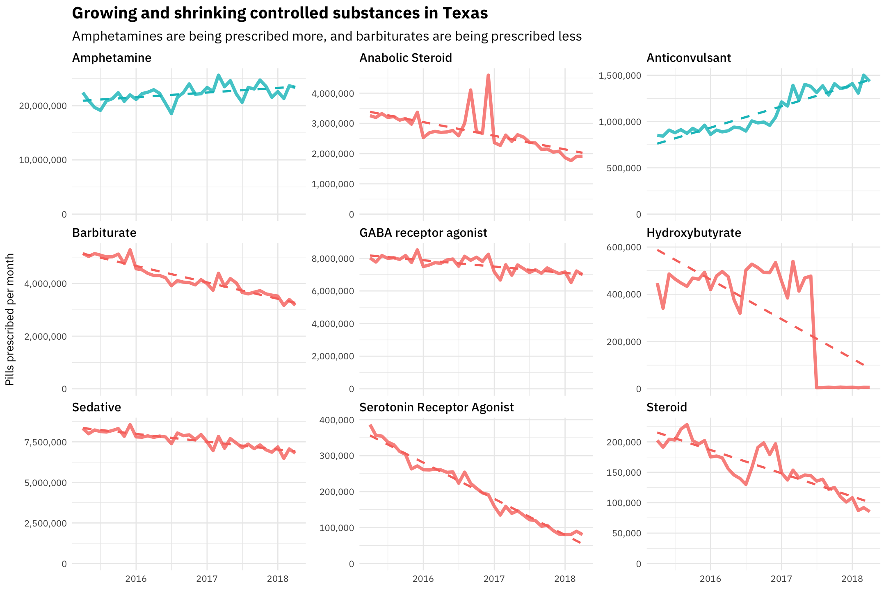
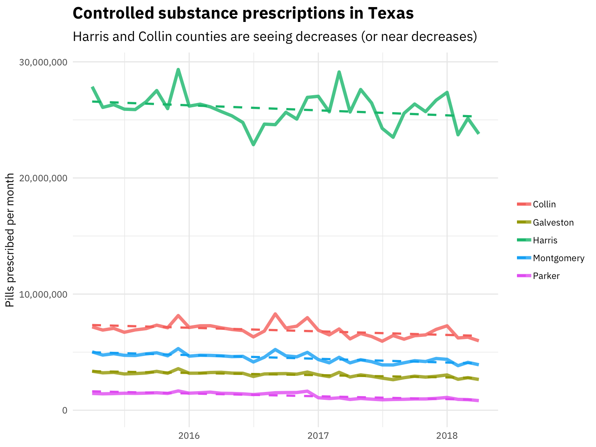
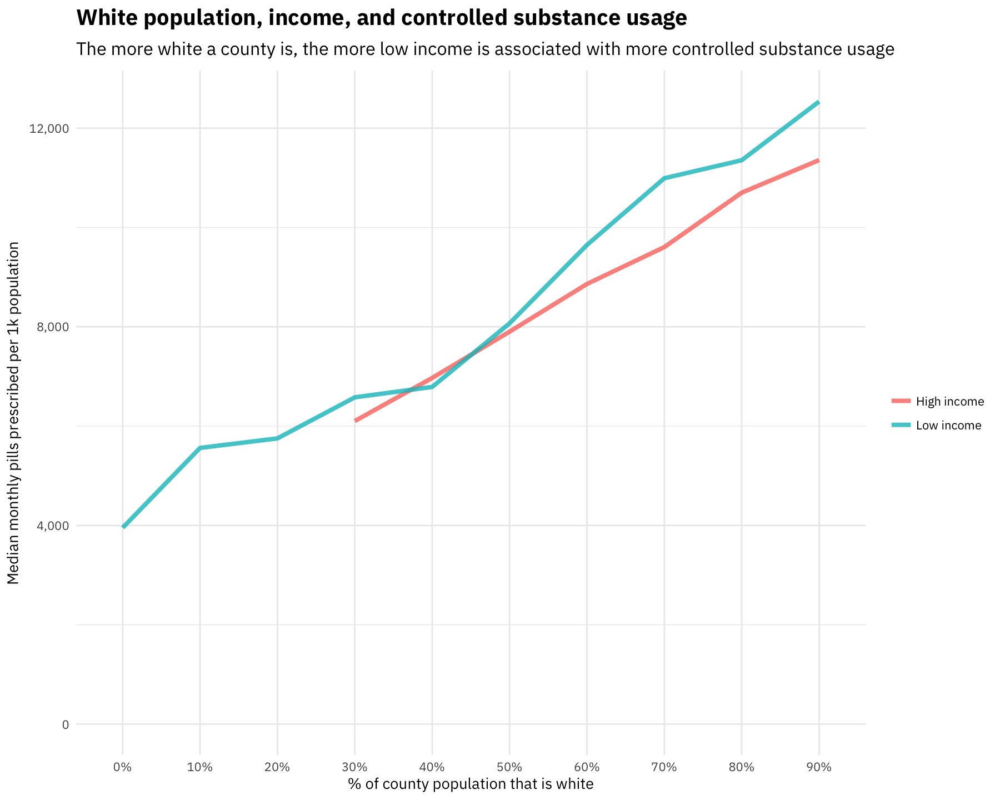

## Clean and tidy controlled substance utilization data

Let's open up the dataset and start munging and preparing it.


```r
library(tidyverse)
library(readxl)
library(lubridate)
library(stringr)

path <- "CountyDrugPillQty_2017_07.xlsx"

opioids_raw <- path %>%
    excel_sheets() %>%
    set_names() %>%
    map_df(~ read_excel(path = path, sheet = .x), .id = "sheet") %>%
    mutate(Date = dmy(str_c("01-", sheet))) %>%
    select(-sheet) %>%
    rename(Name = `Generic Name`)
```


```r
library(googlesheets)

categories_sheet <- gs_title("Drug categories")
drug_categories <- categories_sheet %>%
    gs_read("Sheet1", verbose = FALSE) %>%
    rename(Name = `Generic Name`)

opioids_tidy <- opioids_raw %>%
    gather(County, Pills, ANDERSON:ZAVALA) %>%
    mutate(Pills = ifelse(Pills > 1e10, NA, Pills)) %>%
    replace_na(replace = list(Pills = 0)) %>%
    mutate(County = str_to_title(County)) %>%
    left_join(drug_categories, by = "Name") %>%
    select(County, Date, Name, Category, Schedule, Pills) 

opioids_tidy
```

```
## # A tibble: 926,846 x 6
##      County       Date
##       <chr>     <date>
##  1 Anderson 2015-04-01
##  2 Anderson 2015-04-01
##  3 Anderson 2015-04-01
##  4 Anderson 2015-04-01
##  5 Anderson 2015-04-01
##  6 Anderson 2015-04-01
##  7 Anderson 2015-04-01
##  8 Anderson 2015-04-01
##  9 Anderson 2015-04-01
## 10 Anderson 2015-04-01
## # ... with 926,836 more rows, and 4 more variables: Name <chr>, Category <chr>,
## #   Schedule <chr>, Pills <dbl>
```

Now it's ready to go!

## Total number of pills prescribed over time

What does the overall pattern of pills prescribed looked like?


```r
opioids_tidy %>%
    group_by(Date) %>%
    summarise(Pills = sum(Pills)) %>%
    ggplot(aes(Date, Pills)) +
    geom_smooth(method = "lm") +
    geom_line(size = 1.5, alpha = 0.7) +
    expand_limits(y = 0) +
    labs(x = NULL, y = "Pills prescribed per month",
         title = "Controlled substance prescriptions in Texas",
         subtitle = "The median number of pills prescribed per month in Texas during this time period is 200 million")
```


We see evidence for modest growth over this time period. We would need to compare to the population growth in the same time period to make a meaningful statement about the rate.

## Which drugs are growing or shrinking the fastest?

Let's examine how these prescriptions are changing with time. Let's use linear regression modeling to find the individual drugs that are being prescribed more often now compared to two years ago. Let's start with the schedules (II, III, IV, V).


```r
opioids_tidy %>%
    count(Schedule, wt = Pills, sort = TRUE) %>%
    mutate(Percent = percent(n / sum(n))) %>%
    select(-n) %>%
    kable(col.names = c("Schedule", "% of total pills over this time period"))
```


|Schedule    |% of total pills over this time period |
|:-----------|:--------------------------------------|
|IV          |42.6%                                  |
|II          |36.8%                                  |
|III         |16.8%                                  |
|V           |3.7%                                   |
|Unspecified |0.1%                                   |

```r
opioids_tidy %>%
    count(Schedule, Date, wt = Pills) %>%
    mutate(Schedule = factor(Schedule, levels = c("II", "III", "IV", "V",
                                                  "Unspecified"))) %>%
    ggplot(aes(Date, n, color = Schedule)) +
    geom_line(alpha = 0.8, size = 1.5) +
    expand_limits(y = 0) +
    labs(x = NULL, y = "Pills prescribed per month",
         title = "Controlled substance prescriptions by schedule",
         subtitle = "Schedule IV drugs account for the most doses, with Schedule II close behind")
```


This looks pretty flat, but let's fit some models.


```r
library(broom)

schedule_by_month <- opioids_tidy %>%
    group_by(Schedule, Date) %>%
    summarise(Pills = sum(Pills))

time_models <- schedule_by_month %>%    
    nest(-Schedule) %>%
    mutate(models = map(data, ~ lm(Pills ~ Date, .))) %>%
    unnest(map(models, tidy)) %>%
    filter(term == "Date") %>%
    arrange(desc(estimate))
    
time_models    
```

```
## # A tibble: 5 x 6
##      Schedule  term   estimate std.error statistic      p.value
##         <chr> <chr>      <dbl>     <dbl>     <dbl>        <dbl>
## 1         III  Date  7862.8225 4571.0394  1.720139 0.0977646729
## 2          IV  Date  6114.1057 4828.6464  1.266215 0.2171079519
## 3 Unspecified  Date   644.8115  117.6478  5.480864 0.0000107983
## 4           V  Date   372.2876  243.4479  1.529229 0.1387634278
## 5          II  Date -3592.0228 2595.3153 -1.384041 0.1785783177
```

These models are all asking the question, "What is the rate of change of doses prescribed with time?" The p-values are almost all high, indicating that we aren't seeing increases or decreases, just like we see in the plot. The overall numbers of pills prescribed per month is pretty flat. The only one of these with a significant p-value is "Unspecified" (more doses of unspecified drugs are being prescribed now than in the past), but the absolute number of those is small.

Now let's look at specific drug categories like opioid, stimulant, sedative, and so forth. What are the top 10?


```r
opioids_tidy %>%
    count(Category, wt = Pills, sort = TRUE) %>%
    mutate(Percent = percent(n / sum(n))) %>%
    top_n(10, n) %>%
    select(-n) %>%
    kable(col.names = c("Schedule", "% of total pills over this time period"))
```


|Schedule                    |% of total pills over this time period |
|:---------------------------|:--------------------------------------|
|Opioid                      |54.9%                                  |
|Benzodiazepine              |20.1%                                  |
|Amphetamine                 |10.6%                                  |
|GABA receptor agonist       |3.8%                                   |
|Sedative                    |3.8%                                   |
|Barbiturate                 |2.1%                                   |
|Anabolic Steroid            |1.6%                                   |
|Stimulant                   |1.0%                                   |
|Non-benzodiazepine hypnotic |0.5%                                   |
|Anticonvulsant              |0.5%                                   |

Let's fit some models.


```r
category_by_month <- opioids_tidy %>%
    group_by(Category, Date) %>%
    summarise(Pills = sum(Pills))

time_models <- category_by_month %>%    
    nest(-Category) %>%
    mutate(models = map(data, ~ lm(Pills ~ Date, .))) %>%
    unnest(map(models, tidy)) %>%
    filter(term == "Date") %>%
    #mutate(p.value = p.adjust(p.value)) %>%
    arrange(desc(estimate))
    
time_models    
```

```
## # A tibble: 17 x 6
##                       Category  term      estimate    std.error     statistic
##                          <chr> <chr>         <dbl>        <dbl>         <dbl>
##  1              Benzodiazepine  Date  7890.1091912 4011.7088729   1.966770132
##  2                 Amphetamine  Date  3310.9793829 1040.8390051   3.181067741
##  3             NMDA Antagonist  Date  1768.3765149 2177.6886310   0.812042865
##  4            Anabolic Steroid  Date  1640.3016899 1430.7173738   1.146488971
##  5                 Unspecified  Date   644.8114861  117.6477854   5.480863781
##  6              Anticonvulsant  Date   279.2566388   34.3064496   8.140062345
##  7             Hydroxybutyrate  Date   118.5813180   41.1161393   2.884057696
##  8 Non-benzodiazepine hypnotic  Date   114.5364188   25.8721240   4.427020319
##  9                   Stimulant  Date    99.6909990  161.7088376   0.616484544
## 10                 Cannabinoid  Date    26.4130968    4.2404840   6.228792933
## 11               Phenobarbital  Date    -0.1081127    0.1048886  -1.030737912
## 12       GABA receptor agonist  Date    -1.3689677  245.5036854  -0.005576159
## 13                     Steroid  Date   -64.0199625   16.6412557  -3.847063216
## 14  Serotonin Receptor Agonist  Date  -245.6500611   14.4653548 -16.981958975
## 15                    Sedative  Date  -723.3147267  209.7954668  -3.447713804
## 16                      Opioid  Date -1588.6039402 5653.2961884  -0.281004902
## 17                 Barbiturate  Date -1867.9520047  189.2372196  -9.870954609
## # ... with 1 more variables: p.value <dbl>
```


Which drugs are being prescribed *more*? These are the six fastest growing over this time period.


```r
opioids_tidy %>%
    inner_join(time_models %>%
                   filter(p.value < 0.1) %>%
                   top_n(6, estimate), by = "Category") %>%
    count(Date, Category, wt = Pills) %>%
    ggplot(aes(Date, n, color = Category)) +
    geom_line(size = 1.5, alpha = 0.8) +
    geom_smooth(method = "lm", se = FALSE, lty = 2) +
    scale_y_continuous(labels = scales::comma_format()) +
    expand_limits(y = 0) +
    theme(legend.title=element_blank()) +
    labs(x = NULL, y = "Pills prescribed per month",
         title = "Fastest growing controlled substances in Texas",
         subtitle = "Benzodiazepines and amphetamines are commonly prescribed drugs that show evidence of growth")
```



It's hard to see the changes of the more rare drugs. Let's plot that differently.


```r
opioids_tidy %>%
    inner_join(time_models %>%
                   filter(p.value < 0.1) %>%
                   top_n(6, estimate), by = "Category") %>%
    count(Date, Category, wt = Pills) %>%
    ggplot(aes(Date, n, color = Category)) +
    geom_line(size = 1.5, alpha = 0.8) +
    geom_smooth(method = "lm", se = FALSE, lty = 2) +
    scale_y_continuous(labels = scales::comma_format()) +
    expand_limits(y = 0) +
    facet_wrap(~Category, scales = "free_y") +
    theme(legend.position="none") +
    labs(x = NULL, y = "Pills prescribed per month",
         title = "Fastest growing controlled substances in Texas",
         subtitle = "Many of these are rare drugs and the p-values for the linear models are rather high")
```


Definitely want to remove those "unspecified" drugs for this analysis.


Are there drugs which are decreasing in number of prescriptions?


```r
opioids_tidy %>%
    inner_join(time_models %>%
                   top_n(-5, estimate)) %>%
    count(Date, Category, wt = Pills) %>%
    ggplot(aes(Date, n, color = Category)) +
    geom_line(size = 1.5, alpha = 0.8) +
    geom_smooth(method = "lm", se = FALSE, lty = 2) +
    scale_y_continuous(labels = scales::comma_format()) +
    expand_limits(y = 0) +
    theme(legend.title=element_blank()) +
    labs(x = NULL, y = "Pills prescribed per month",
         title = "Flat and shrinking controlled substances in Texas",
         subtitle = "The large opioid category is fairly flat")
```


```r
opioids_tidy %>%
    inner_join(time_models %>%
                   top_n(-6, estimate)) %>%
    count(Date, Category, wt = Pills) %>%
    ggplot(aes(Date, n, color = Category)) +
    geom_line(size = 1.5, alpha = 0.8) +
    geom_smooth(method = "lm", se = FALSE, lty = 2) +
    scale_y_continuous(labels = scales::comma_format()) +
    expand_limits(y = 0) +
    facet_wrap(~Category, scales = "free_y") +
    theme(legend.position="none") +
    labs(x = NULL, y = "Pills prescribed per month",
         title = "Flat and shrinking controlled substances in Texas",
         subtitle = "Barbiturates and sedatives are being prescribed less often")
```


Again, the p-values for some of these fits, like for example for steroids, are high.

## Where is controlled substance use changing?

Let's use linear modeling to find counties where controlled substance use is changing.


```r
library(broom)

opioids_by_county <- opioids_tidy %>%
    group_by(County, Date) %>%
    summarise(Pills = sum(Pills))

county_models <- opioids_by_county %>%    
    nest(-County) %>%
    mutate(models = map(data, ~ lm(Pills ~ Date, .))) %>%
    unnest(map(models, tidy)) %>%
    filter(term == "Date") %>%
    arrange(desc(estimate))
    
county_models    
```

```
## # A tibble: 254 x 6
##       County  term  estimate std.error statistic    p.value
##        <chr> <chr>     <dbl>     <dbl>     <dbl>      <dbl>
##  1    Dallas  Date 6224.0684 3696.2856 1.6838710 0.10465391
##  2   Tarrant  Date 4058.3246 1481.0018 2.7402564 0.01116465
##  3    Denton  Date  876.4351  490.5340 1.7866958 0.08612034
##  4 Val Verde  Date  493.6089  193.5700 2.5500278 0.01728016
##  5     Gregg  Date  463.0589  202.2123 2.2899640 0.03073389
##  6     Bexar  Date  426.4094  982.2007 0.4341367 0.66791299
##  7    Collin  Date  337.6316  360.4081 0.9368035 0.35782198
##  8  Mclennan  Date  277.5202  242.4875 1.1444722 0.26326746
##  9     Ellis  Date  260.6787  222.5309 1.1714272 0.25247114
## 10      Hill  Date  258.5444  136.5157 1.8938809 0.06986816
## # ... with 244 more rows
```

Which counties have seen the biggest increases?


```r
opioids_by_county %>%
    inner_join(county_models %>%
                   top_n(5, estimate)) %>%
    ggplot(aes(Date, Pills, color = County)) +
    geom_line(size = 1.5, alpha = 0.8) +
    geom_smooth(method = "lm", se = FALSE, lty = 2) +
    scale_y_continuous(labels = scales::comma_format()) +
    expand_limits(y = 0) +
    theme(legend.title=element_blank()) +
    labs(x = NULL, y = "Pills prescribed per month",
         title = "Controlled substance prescriptions in Texas",
         subtitle = "Dallas, Tarrant, and Denton are seeing the fastest growth")
```


What are counties that are experiencing decreases?


```r
opioids_by_county %>%
    inner_join(county_models %>%
                   top_n(-5, estimate)) %>%
    ggplot(aes(Date, Pills, color = County)) +
    geom_line(size = 1.5, alpha = 0.8) +
    geom_smooth(method = "lm", se = FALSE, lty = 2) +
    scale_y_continuous(labels = scales::comma_format()) +
    expand_limits(y = 0) +
    theme(legend.title=element_blank()) +
    labs(x = NULL, y = "Pills prescribed per month",
         title = "Controlled substance prescriptions in Texas",
         subtitle = "Harris and Travis counties are seeing decreases (or near decreases)")
```




## Connecting to Census data

Let's download some Census data to connect to this controlled substance prescription data.


```r
library(tidycensus)

population <- get_acs(geography = "county", 
                      variables = "B01003_001", 
                      state = "TX",
                      geometry = TRUE) 

population
```

```
## Simple feature collection with 254 features and 5 fields
## geometry type:  MULTIPOLYGON
## dimension:      XY
## bbox:           xmin: -106.6456 ymin: 25.83738 xmax: -93.50829 ymax: 36.5007
## epsg (SRID):    4269
## proj4string:    +proj=longlat +datum=NAD83 +no_defs
## # A tibble: 254 x 6
##    GEOID                    NAME   variable estimate   moe          geometry
##    <chr>                   <chr>      <chr>    <dbl> <dbl>  <simple_feature>
##  1 48007   Aransas County, Texas B01003_001    24292     0 <MULTIPOLYGON...>
##  2 48025       Bee County, Texas B01003_001    32659     0 <MULTIPOLYGON...>
##  3 48035    Bosque County, Texas B01003_001    17971     0 <MULTIPOLYGON...>
##  4 48067      Cass County, Texas B01003_001    30328     0 <MULTIPOLYGON...>
##  5 48083   Coleman County, Texas B01003_001     8536     0 <MULTIPOLYGON...>
##  6 48091     Comal County, Texas B01003_001   119632     0 <MULTIPOLYGON...>
##  7 48103     Crane County, Texas B01003_001     4730     0 <MULTIPOLYGON...>
##  8 48139     Ellis County, Texas B01003_001   157058     0 <MULTIPOLYGON...>
##  9 48151    Fisher County, Texas B01003_001     3858     0 <MULTIPOLYGON...>
## 10 48167 Galveston County, Texas B01003_001   308163     0 <MULTIPOLYGON...>
## # ... with 244 more rows
```

```r
household_income <- get_acs(geography = "county", 
                            variables = "B19013_001", 
                            state = "TX",
                            geometry = TRUE) 

household_income
```

```
## Simple feature collection with 254 features and 5 fields
## geometry type:  MULTIPOLYGON
## dimension:      XY
## bbox:           xmin: -106.6456 ymin: 25.83738 xmax: -93.50829 ymax: 36.5007
## epsg (SRID):    4269
## proj4string:    +proj=longlat +datum=NAD83 +no_defs
## # A tibble: 254 x 6
##    GEOID                    NAME   variable estimate   moe          geometry
##    <chr>                   <chr>      <chr>    <dbl> <dbl>  <simple_feature>
##  1 48007   Aransas County, Texas B19013_001    41690  3678 <MULTIPOLYGON...>
##  2 48025       Bee County, Texas B19013_001    42302  3403 <MULTIPOLYGON...>
##  3 48035    Bosque County, Texas B19013_001    44674  3329 <MULTIPOLYGON...>
##  4 48067      Cass County, Texas B19013_001    37352  2430 <MULTIPOLYGON...>
##  5 48083   Coleman County, Texas B19013_001    35156  4158 <MULTIPOLYGON...>
##  6 48091     Comal County, Texas B19013_001    65833  3291 <MULTIPOLYGON...>
##  7 48103     Crane County, Texas B19013_001    58333  6374 <MULTIPOLYGON...>
##  8 48139     Ellis County, Texas B19013_001    62465  2002 <MULTIPOLYGON...>
##  9 48151    Fisher County, Texas B19013_001    41406  2956 <MULTIPOLYGON...>
## 10 48167 Galveston County, Texas B19013_001    62313  1675 <MULTIPOLYGON...>
## # ... with 244 more rows
```


```r
opioids_joined <- opioids_by_county %>% 
    group_by(County) %>% 
    summarise(Pills = median(Pills)) %>% 
    mutate(County = str_to_lower(str_c(County, " County, Texas")),
           County = ifelse(County == "de witt county, texas",
                           "dewitt county, texas", County)) %>%
    inner_join(population %>% mutate(County = str_to_lower(NAME)), by = "County") %>%
    mutate(OpioidRate = Pills / estimate * 1e3)
```


#### Controlled substance prescription rate in the top 10 most populous Texas counties


```r
opioids_joined %>% 
    top_n(10, estimate) %>%
    arrange(desc(estimate)) %>%
    select(NAME, OpioidRate) %>%
    kable(col.names = c("County", "Median monthly pills per 1k population"))
```


|County                  | Median monthly pills per 1k population|
|:-----------------------|--------------------------------------:|
|Harris County, Texas    |                               5961.737|
|Dallas County, Texas    |                               6428.637|
|Tarrant County, Texas   |                               8153.923|
|Bexar County, Texas     |                               7675.340|
|Travis County, Texas    |                               6817.179|
|Collin County, Texas    |                               8234.587|
|El Paso County, Texas   |                               4598.198|
|Hidalgo County, Texas   |                               3536.033|
|Denton County, Texas    |                               8123.296|
|Fort Bend County, Texas |                               5531.874|


We can also map the state as a whole.


```r
library(sf)
library(leaflet)
library(viridis)

opioids_map <- opioids_joined %>%
    mutate(OpioidRate = ifelse(OpioidRate > 1.6e4, 1.6e4, OpioidRate))

opioids_map %>%
    st_as_sf() %>%
    ggplot(aes(fill = OpioidRate, color = OpioidRate)) + 
    geom_sf() + 
    coord_sf() + 
    scale_fill_viridis() + 
    scale_color_viridis(guide = FALSE) +
    labs(fill = "Monthly pills\nper 1k population")
```


There are low rates in the Rio Grande Valley and high rates in north and east Texas.

Is there a direct relationship with income? Do we see connections to the financial status of a county?


```r
opioids_joined %>% 
    filter(OpioidRate < 2e4) %>%
    group_by(GEOID, Population = estimate) %>% 
    summarise(OpioidRate = median(OpioidRate)) %>%
    inner_join(household_income %>%
                   as.data.frame() %>%
                   select(-geometry, -variable) %>%
                   rename(Income = estimate)) %>%
    ggplot(aes(Income, OpioidRate, size = Population)) +
    geom_point(alpha = 0.7) +
    geom_smooth(method = "lm", show.legend = FALSE) +
    scale_x_continuous(labels = scales::dollar_format()) +
    scale_y_continuous(labels = scales::comma_format()) +
    labs(x = "Median household income", 
         y = "Median monthly prescriped pills per 1k population",
         title = "Income and controlled substance prescriptions",
         subtitle = "There are no obvious direct relationships between income and prescriptions")
```


Not really. There are no strong relationships there, except we can notice that all the extremely populous counties are below the line, with lower controlled substance usage.

What about race?


```r
race_vars <- c("P0050003", "P0050004", "P0050006", "P0040003")

texas_race <- get_decennial(geography = "county", 
                            variables = race_vars, 
                            state = "TX",
                            summary_var = "P0010001") 

texas_race
```

```
## # A tibble: 1,016 x 5
##    GEOID             NAME variable value summary_value
##    <chr>            <chr>    <chr> <dbl>         <dbl>
##  1 48001  Anderson County P0050003 35792         58458
##  2 48003   Andrews County P0050003  7083         14786
##  3 48005  Angelina County P0050003 54889         86771
##  4 48007   Aransas County P0050003 16350         23158
##  5 48009    Archer County P0050003  8182          9054
##  6 48011 Armstrong County P0050003  1725          1901
##  7 48013  Atascosa County P0050003 16295         44911
##  8 48015    Austin County P0050003 18657         28417
##  9 48017    Bailey County P0050003  2745          7165
## 10 48019   Bandera County P0050003 16576         20485
## # ... with 1,006 more rows
```


```r
library(forcats)

race_joined <- texas_race %>%
    mutate(PercentPopulation = value / summary_value,
           variable = fct_recode(variable,
                                 White = "P0050003",
                                 Black = "P0050004",
                                 Asian = "P0050006",
                                 Hispanic = "P0040003")) %>%
    inner_join(opioids_joined %>%
                   filter(OpioidRate < 2e4) %>%
                   group_by(GEOID) %>% 
                   summarise(OpioidRate = median(OpioidRate)))

race_joined %>%
    rename(Population = summary_value) %>%
    ggplot(aes(PercentPopulation, OpioidRate, 
               size = Population, color = variable)) +
    geom_point(alpha = 0.4) +
    #geom_smooth(method = "lm", lty = 2, se = FALSE) +
    facet_wrap(~variable) +
    #theme(legend.position="none") +
    scale_x_continuous(labels = scales::percent_format()) +
    scale_y_continuous(labels = scales::comma_format()) +
    scale_color_discrete(guide = FALSE) +
    labs(x = "% of county population in that racial/ethnic group",
         y = "Median monthly pills prescribed per 1k population",
         title = "Race and controlled substance prescriptions",
         subtitle = "The more white a county is, the higher the median monthly pills prescribed there",
         size = "County\npopulation")
```


The more white a county is, the higher the rate of controlled substance prescription there. The more Hispanic a county is, the lower the rate of controlled substance prescription there. We did not see an effect with income, though.

We could build a model to predict the monthly prescriptions with both race and income (and anything else we come up with) and see what has an effect when you control for all of it. Using the simple exploratory model below, it looks like it may be an interaction of race and income, i.e., poorer counties with large white populations have high rates of controlled substance use.


```r
model_opioids <- race_joined %>%
    select(GEOID, OpioidRate, TotalPop = summary_value,
           variable, PercentPopulation) %>%
    spread(variable, PercentPopulation) %>%
    left_join(household_income %>% 
                  select(GEOID, Income = estimate)) %>%
    select(-geometry, -GEOID) %>%
    lm(OpioidRate ~ Income * White, data = .)

summary(model_opioids)
```

```
## 
## Call:
## lm(formula = OpioidRate ~ Income * White, data = .)
## 
## Residuals:
##     Min      1Q  Median      3Q     Max 
## -5285.6 -1123.6    60.1  1151.2  4985.2 
## 
## Coefficients:
##                Estimate Std. Error t value Pr(>|t|)    
## (Intercept)   4.169e+03  1.372e+03   3.039  0.00263 ** 
## Income        3.449e-03  3.269e-02   0.106  0.91606    
## White         1.291e+04  2.231e+03   5.786 2.16e-08 ***
## Income:White -9.911e-02  5.173e-02  -1.916  0.05654 .  
## ---
## Signif. codes:  0 '***' 0.001 '**' 0.01 '*' 0.05 '.' 0.1 ' ' 1
## 
## Residual standard error: 1850 on 248 degrees of freedom
##   (1 observation deleted due to missingness)
## Multiple R-squared:  0.4926,	Adjusted R-squared:  0.4865 
## F-statistic: 80.26 on 3 and 248 DF,  p-value: < 2.2e-16
```

We can explore that kind of interaction visually.


```r
race_joined %>%
    filter(variable == "White") %>%
    left_join(household_income %>% 
                  as.data.frame() %>% 
                  select(GEOID, Income = estimate)) %>%
    ggplot(aes(PercentPopulation, OpioidRate, color = Income)) +
    geom_point(size = 3, alpha = 0.8) +
    scale_color_viridis_c(labels = scales::dollar_format()) +
    scale_x_continuous(labels = scales::percent_format()) +
    scale_y_continuous(labels = scales::comma_format()) +
    labs(x = "% of county population that is white",
         y = "Median monthly pills prescribed per 1k population",
         title = "White population, income, and controlled substance usage",
         subtitle = "At the same proportion of white population, poorer counties have higher controlled substance usage")
```


```r
race_joined %>%
    filter(variable == "White") %>%
    left_join(household_income %>% 
                  as.data.frame() %>% 
                  select(GEOID, Income = estimate)) %>%
    filter(!is.na(Income)) %>%
    mutate(Income = ifelse(Income <= median(Income, na.rm = TRUE), 
                           "Low income", "High income"),
           PercentPopulation = cut_width(PercentPopulation, 0.1)) %>%
    group_by(PercentPopulation, Income) %>%
    summarise(OpioidRate = median(OpioidRate)) %>%
    complete(PercentPopulation, Income) %>%
    ggplot(aes(PercentPopulation, OpioidRate, fill = Income)) +
    geom_col(position = "dodge", alpha = 0.8) +
    scale_y_continuous(labels = scales::comma_format()) +
    labs(x = "% of county population that is white",
         y = "Median monthly pills prescribed per 1k population",
         title = "White population, income, and controlled substance usage",
         subtitle = "The more white a county is, the more low income is associated with more controlled substance usage")
```




This plot illustrates the interaction between white population percentage and income pretty well. The difference in controlled substance usage between lower and higher income counties changes along the spectrum of counties' population that is white.

The first effect to notice here is of course that the more white a county is, the higher the rate of controlled substance prescriptions. The second thing, though, is to compare the heights of the two sets of bars in each bin. In less white counties, higher income is associated with more controlled substance prescriptions but in more white counties, lower income is associated with more prescriptions. The effect of income on the prescription rate switches sign, from positive to negative.

Here is another way to visualize this that might make it more clear.


```r
race_joined %>%
    filter(variable == "White") %>%
    left_join(household_income %>% 
                  as.data.frame() %>% 
                  select(GEOID, Income = estimate)) %>%
    filter(!is.na(Income)) %>%
    mutate(Income = ifelse(Income <= median(Income, na.rm = TRUE), 
                           "Low income", "High income"),
           PercentPopulation = cut_width(PercentPopulation, 0.1)) %>%
    group_by(PercentPopulation, Income) %>%
    summarise(OpioidRate = median(OpioidRate)) %>%
    complete(PercentPopulation, Income) %>%
    ggplot(aes(PercentPopulation, OpioidRate, color = Income, group = Income)) +
    geom_line(size = 1.2, alpha = 0.8) +
    scale_y_continuous(labels = scales::comma_format(),
                       limits = c(0, NA)) +
    labs(x = "% of county population that is white",
         y = "Median monthly pills prescribed per 1k population",
         title = "White population, income, and controlled substance usage",
         subtitle = "The more white a county is, the more low income is associated with more controlled substance usage")
```


## Connecting to overdoses

We can also use the data gathered on overdoses due to prescriptions controlled substances and other drugs to see what connections there are.


```r
path <- "UTSouthwestern170731Opioids.xls"

overdoses_tidy <- path %>%
    excel_sheets() %>%
    set_names() %>%
    map_df(~ read_excel(path = path, sheet = .x, skip = 9), .id = "sheet") %>%
    gather(Date, Overdoses, `201301`:`201706`) %>%
    mutate(Date = ymd(str_c(Date, "01")),
           Overdoses = case_when(Overdoses == "*" ~ "Less than 5",
                                 as.numeric(Overdoses) < 10 ~ "5 to 10",
                                 as.numeric(Overdoses) > 10 ~ "More than 10",
                                 is.na(Overdoses) ~ "Zero"),
           Overdoses = factor(Overdoses, levels = c("Zero", "Less than 5",
                                                    "5 to 10", "More than 10")))
```


```r
overdoses_tidy %>%
    inner_join(opioids_by_county %>%
                   ungroup %>%
                   mutate(County = toupper(County)), 
               by = c("County", "Date")) %>%
    filter(!is.na(Overdoses)) %>%
    ggplot(aes(Overdoses, Pills, fill = sheet)) +
    geom_boxplot(outlier.alpha = 0.5, alpha = 0.8,
                 show.legend = FALSE, position = "dodge") +
    facet_wrap(~sheet) +
    scale_y_log10() +
    labs(y = "Median monthly pills prescribed per 1k population",
         title = "Overdoses and prescriptions in Texas counties",
         subtitle = "Counties with higher rates of prescriptions have higher rates of overdoses from all classes of drugs")
```


Having higher rates of overdoses (more than 10 in a month) is rare but we do see that counties with higher rates of overdoses are the counties with higher rates of controlled substance prescriptions. The counties with zero overdoses have a broad range of controlled substance prescription rates.

We see that having higher prescriptions rates is associated with higher overdoses for *all* types of drugs. We could look at how many more overdoses there are and see if the increase is larger for, say, heroin and opioids than for unrelated drugs.
